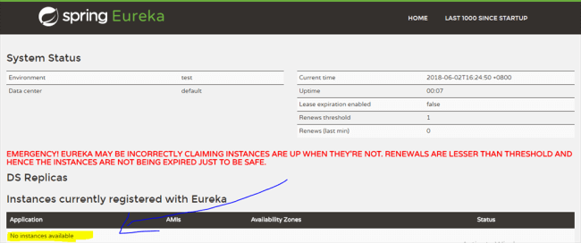
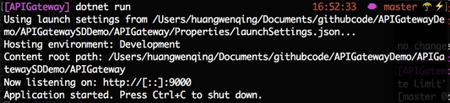

[TOC]

### 什么是服务发现?

服务发现是自动检测计算机网络上的设备以及这些设备提供的服务。SDP (service discovery protocol)是一种帮助实现服务发现的网络协议。服务发现的目的是减少用户的配置工作量。

我们可以在Ocelot中使用一些类型的服务发现，例如Consul、Eureka等等。Ocelot使用Steeltoe与Eureka进行通信，Eureka是一个开源项目，允许. net开发人员在为云构建弹性微服务时实现行业标准的最佳实践。

#### **Step 1** 

我们首先创建两个API服务(BookService、CustomerService)。只需创建默认的ASP.NET Core Web API项目。在API网关可以发现我们的API服务之前，我们需要在Eureka服务器中注册它们。


安装Eureka客户端包

```powershell
dotnet add package Steeltoe.Discovery.ClientCore --version 2.0.1
```


在BookService appsettings.json中添加一些配置：

```json
"spring": {  
    "application": {  
        "name": "BookService"/*ocelot will use it to find out this service*/
    }  
},  
"eureka": {  
    "client": {  
        "serviceUrl": "http://192.168.0.107:8761/eureka/",/*ServiceUrl is the endpoint of the Eureka Server*/ 
        "shouldFetchRegistry": true,  
        "validateCertificates": false  
    },  
    "instance": {  
        "port": 9001,  
        "instanceId": "192.168.0.103:9001",  
        "hostName": "192.168.0.103",  
        "healthCheckUrlPath": "/api/values/healthcheck",  
        "statusPageUrlPath": "/api/values/info"                  
    }  
}  
```

注意：

1. "name": "BookService"是一个重要的部分，ocelot将使用它来查找该服务。
2. ServiceUrl是Eureka Server的端点。
3. 更多配置查看[Netflix Eureka | Steeltoe](https://docs.steeltoe.io/api/v3/discovery/netflix-eureka.html)


添加一些代码以启用服务发现：

```c#
public class Startup  
{  
    public Startup(IConfiguration configuration)  
    {  
        Configuration = configuration;  
    }  
  
    public IConfiguration Configuration { get; }  
  
    public void ConfigureServices(IServiceCollection services)  
    {  
        services.AddDiscoveryClient(Configuration);  
        services.AddMvc();  
    }  
  
    public void Configure(IApplicationBuilder app, IHostingEnvironment env)  
    {  
        if (env.IsDevelopment())  
        {  
            app.UseDeveloperExceptionPage();  
        }  
  
        app.UseDiscoveryClient();  
        app.UseMvc();  
    }  
}  
```


#### **Step 2** 

创建APIGateway项目。并添加一个名为ocelot.json的json配置文件。

```json
{
    "ReRoutes": [
      {
        "DownstreamPathTemplate": "/api/health",
        "DownstreamScheme": "http",
        "UpstreamPathTemplate": "/book",
        "UseServiceDiscovery": true, /*配置为使用服务发现*/
        "ServiceName": "BookService", /*BookService服务配置的服务名称*/
        "UpstreamHttpMethod": [ "Get" ],
        "QoSOptions": {
          "ExceptionsAllowedBeforeBreaking": 3,
          "DurationOfBreak": 1000,
          "TimeoutValue": 5000
        },
        "FileCacheOptions": { "TtlSeconds": 15 },
        "LoadBalancerOptions": {
          "Type": "RoundRobin" /*负载均衡策略*/
        }
      },
      {
        "DownstreamPathTemplate": "/api/health",
        "DownstreamScheme": "http",
        "UpstreamPathTemplate": "/customer",
        "UseServiceDiscovery": true,
        "ServiceName": "CustomerService",
        "UpstreamHttpMethod": [ "Get" ],
        "QoSOptions": {
          "ExceptionsAllowedBeforeBreaking": 3,
          "DurationOfBreak": 1000,
          "TimeoutValue": 5000
        },
        "FileCacheOptions": { "TtlSeconds": 15 }
      }
    ],
  "GlobalConfiguration": {
    "RequestIdKey": "OcRequestId",
    "AdministrationPath": "/administration",
    "ServiceDiscoveryProvider": { "Type": "Eureka" } /*服务发现提供者*/
  }
}
```

注意：

1. 设置UseServiceDiscovery为true;
2. 将ServiceName设置为API服务中定义的服务名称。
3. 不要指定DownstreamHostAndPorts
4. 设置LoadBalancerOptions类型为RoundRobin
5. 需指定ServiceDiscoveryProvider。设置类型为Eureka

转到Program.cs，启用Ocelot：

```c#
public class Program  
{  
    public static void Main(string[] args)  
    {  
        BuildWebHost(args).Run();  
    }  
  
    public static IWebHost BuildWebHost(string[] args) =>  
        WebHost.CreateDefaultBuilder(args)  
           .UseUrls("http://*:9000")  
           .ConfigureAppConfiguration((hostingContext, config) =>  
            {  
                config  
                    .SetBasePath(hostingContext.HostingEnvironment.ContentRootPath)                        
                    .AddJsonFile("ocelot.json")  
                    .AddEnvironmentVariables();  
            })  
           .ConfigureServices(s =>  
            {  
                s.AddOcelot();  
            })  
            .Configure(a =>  
            {  
                a.UseOcelot().Wait();  
            })  
            .Build();  
}  
```

#### **Step 3**

运行Eureka服务



Eureka Server已经启动，但是没有可用的实例。

注意：

要在计算机中运行Eureka服务器，可以尝试以下步骤：

1. 安装Java 8 JDK
2. 安装Maven 3.x
3. 克隆[Spring Cloud Samples Eureka存储库](https://github.com/spring-cloud-samples/eureka.git)
4. 转到eureka server目录(eureka)，并使用mvn spring-boot:run启动它

或Docker运行Eureka

1. 找到[eureka Docker Image](https://hub.docker.com/r/springcloud/eureka/tags)
2. docker pull springcloud/eureka:latest
3. 运行Docker Image




#### **Step 4** 

如何注册我们的服务?只要运行我们的项目!我们以BookService服务为例。

运行API服务后，我们可以在Eureka服务器上发现BookService已经启动了!


现在，让我们运行API Gateway。


通过API网关访问BookService：


通过API网关访问我们还没有运行的CustomerService：


参考：

[Building API Gateway Using Ocelot In ASP.NET Core](https://www.c-sharpcorner.com/article/building-api-gateway-using-ocelot-in-asp-net-core-service-discoveryeureka/)

