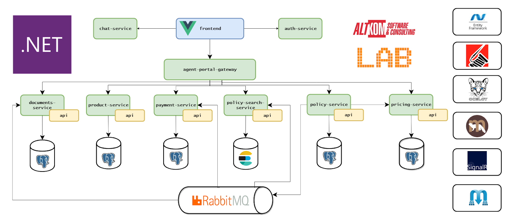
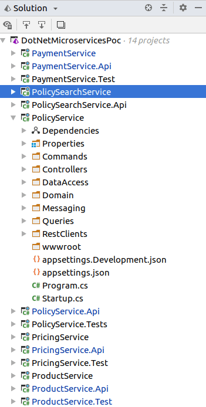

[TOC]

### 如何构建.NET Core微服务

### 教程第1部分:开发计划

我从一开始就喜欢.NET技术。事实上，我在2004年左右离开了过度XML化J2EE开发的黑暗之星，加入了反抗的队伍。多年来，我在Altkom软件咨询公司的团队为保险和银行建立并维护了越来越复杂的业务解决方案。当Java停滞不前时，. NET平台发展迅速。一些开源库被创建并被广泛采用，例如NHibernate、Castle Project或log4net。有了ASP.NET MVC情况就更好了。但在2014年左右，随着微软将大量资源转为开发.NET Core，情况发生了变化。这个想法看起来很棒——让.NET在所有主要平台上运行。但它花了很多年才实现，第一个版本有点令人失望。如此多的API缺失导致许多我们最喜欢的库没有被移植。第一个版本的Entity Framework缺乏关键的特性。. NET的未来似乎令人怀疑。与此同时，Java 8的出现为这门语言带来了清爽的感觉，同时也出现了基于微服务的架构方法。这和[Spring Boot](https://spring.io/projects/spring-boot)一起说服了我重回Java的怀抱。

但是最近的.NET版本——尤其是.NET Core 2.x和.NET Standard的创想使我相信.NET Core又回到了商业领域。因此，我和我的团队决定探索在.NET Core上构建基于微服务的解决方案的可能性和挑战。

自2015年以来，我们在这种架构方法中开发和部署系统，在微服务领域拥有丰富的经验。我们希望找到处理典型微服务相关任务的可能选项，如服务发现、服务同步和异步通信、对各种数据源(关系数据库和noSQL)的数据访问、日志记录、弹性、错误处理、JWT安全检查和API网关构建。

### 计划

在本系列文章中，我们将介绍构建基于微服务的解决方案所需的典型任务。

这些任务包括:

- 微服务的内部架构设计
  - CQRS
  - 事件溯源
- 访问数据源
  - PostgreSQL使用Entity Framework Core
  - NHibernate
  - PostgreSQL使用Marten 
  - ElasticSearch使用NEST 
- 微服务之间的通信
  - 直接HTTP REST同步调用
  - 异步使用RabbitMQ
- 基于Ocelot的API网关
- 使用Eureka发现服务
- 使用Polly弹性处理
- 使用Serilog进行日志记录
- 使用JWT确保服务安全
- 使用Hangfire运行后台作业
- 使用ELK进行日志聚合
- 指标和监控
- Azure DevOps的CI/CD
- 将服务部署到
  - Azure
  - Kubernetes

### 已发表文章一览表

第1部分:[开发计划](https://github.com/amerina/NetCoreGrowthGuide/blob/main/ToolStep/MicroServiceBasic/Microservices/Article_CN/第1部分开发计划.md)

第2部分:[用CQRS和MediatR塑造微服务内部架构](https://github.com/amerina/NetCoreGrowthGuide/blob/main/ToolStep/MicroServiceBasic/Microservices/Article_CN/第2部分用CQRS和MediatR塑造微服务内部架构.md)

第3部分:[使用Eureka发现服务](https://github.com/amerina/NetCoreGrowthGuide/blob/main/ToolStep/MicroServiceBasic/Microservices/Article_CN/第3部分使用Eureka发现服务.md)

第4部分:[用Ocelot构建API网关](https://github.com/amerina/NetCoreGrowthGuide/blob/main/ToolStep/MicroServiceBasic/Microservices/Article_CN/第4部分用Ocelot构建API网关.md)

第5部分:[为你的领域聚合创建一个理想的存储库](https://github.com/amerina/NetCoreGrowthGuide/blob/main/ToolStep/MicroServiceBasic/Microservices/Article_CN/第5部分为你的领域聚合创建一个理想的存储库.md)

第6部分:[与SignalR和RabbitMQ的实时服务器客户端通信](https://github.com/amerina/NetCoreGrowthGuide/blob/main/ToolStep/MicroServiceBasic/Microservices/Article_CN/第6部分与SignalR和RabbitMQ的实时服务器客户端通信.md)

第7部分:[用RabbitMQ构建事务发件箱](https://github.com/amerina/NetCoreGrowthGuide/blob/main/ToolStep/MicroServiceBasic/Microservices/Article_CN/第7部分用RabbitMQ构建事务发件箱.md)

### 业务用例

我们将为保险代理人建立一个非常简单的系统来销售各种保险产品。

保险代理将必须登录，系统将向他们展示他们可以销售的产品列表。代理商将能够查看产品并找到适合他们客户的产品。然后，他们可以创建一个报价，系统将根据提供的参数计算价格。

最后代理将已经确认的销售转换为保险单并打印PDF证书。

门户网站还将为他们提供搜索和查看策略和保单的能力。

门户网站还将提供一些基本的社交网络功能，比如为保险代理提供聊天功能。

### 解决方案架构

下面是我们的系统架构图：

系统包括:

- **前端**—VueJS单页应用程序，为保险代理人提供了为客户选择合适产品、计算价格、创建报价并通过将报价转换为保单来结束销售过程的能力。此应用程序还提供了策略和报价的搜索和查看功能。前端通过*api-gateway*与后端服务对话。
- **代理门户网关**—是一个特殊的微服务，其主要目的是对客户端应用程序隐藏底层后台服务结构的复杂性。通常我们为每个客户端应用程序创建一个专用的API网关。如果将来我们将Xamarin移动应用程序添加到我们的系统中，我们将需要为它构建一个专用的API网关。API网关还提供了安全屏障，不允许未经身份验证的请求传递到后端服务。API网关的另一种流行用法是来自多个服务的内容聚合。
- **身份验证服务**—负责用户身份验证的服务。我们的安全系统将基于JWT令牌。一旦用户正确地识别了自己，认证服务就会发出一个令牌，进一步用于检查用户权限和可用产品。
- **聊天服务**—这是一种使用SignalR的服务，可以让代理之间相互聊天。
- **定价服务**—一种服务，负责根据给定保险产品的参数计算其价格。
- **保险单服务**—本系统主要服务。它负责报价和保单的创建。它通过REST HTTP调用使用定价服务来计算价格。一旦创建了一个保单，它就会向事件总线(RabbitMQ)发送异步事件，以便其他服务可以做出反应。
- **保单查询服务**—该服务的唯一目的是公开搜索功能。该服务订阅与保单生命周期相关的事件，并在ElasticSearch中索引给定的保单，以提供高级搜索功能。
- **支付服务**—该服务负责管理与保单相关的财务操作。它订阅与保单相关的事件，在创建保单时创建保单帐户，注册预期的付款。它还有一个非常简单的后台作业，用于解析包含传入付款的文件并将其分配到适当的保单帐户。
- **产品服务**—这是一份产品目录。它提供了关于每个保险产品及其参数的基本信息，可以在为客户创建报价时自定义这些信息。
- **文档服务**—该服务使用JS Report生成PDF证书。

如您所见，服务是按业务能力分解的。我们还有一项技术服务——文件服务。当技术服务需要可伸缩性/弹性，并且我们希望减少更新/修复或许可成本的时间时，引入技术服务是有意义的。

每个微服务都是围绕DDD术语中的[有界上下文](https://martinfowler.com/bliki/BoundedContext.html)构建的。你还可以观察到，他们合作实现主要业务目标-向最终客户销售保险产品。

### 解决方案结构

下面是我们在**Rider IDE**中打开的解决方案的一个片段。正如你所看到的，我们为每个微服务创建了三个项目:一个用于API定义，一个用于实现，一个用于测试。你可以在[GitHub](https://github.com/amerina/NetCoreGrowthGuide/blob/main/ToolStep/MicroServiceBasic/Microservices)上找到我们项目的源代码。请注意，项目尚在开发中，代码将随着我们系列的进展而更改。

API定义项目包含类和以接口形式向外部世界描述公开的服务功能，以及它可以处理的命令、它可以回答的查询、它发出的事件和它公开的数据传输对象。我们可以将它们视为[端口和适配器体系结构中的端口定义](https://herbertograca.com/2017/09/14/ports-adapters-architecture/)。

实现项目包含命令处理程序、查询处理程序和通知处理程序，它们共同提供服务功能。大部分业务逻辑在领域模型部分实现。用于与外部世界通信的适配器被实现为控制器(用于处理传入的HTTP请求)、侦听器(用于通过队列传递的事件)和REST客户端(用于处理传出的HTTP请求)。

测试项目包括单元测试和集成测试。

### 总结

在我们看来，. NET Core是一个构建微服务的伟大平台，在本系列文章中，我们将证明这一点。围绕它有一个丰富的开源工具和库的生态系统。C#语言本身就是一个很棒的工具。

平台和库都是开源的，新功能以非常快的速度交付。

还有. NET Core 2.X在性能和内存使用方面的增强使其更具吸引力。

在接下来的文章中，我们将介绍与微服务实现和部署相关的常见任务的解决方案。

