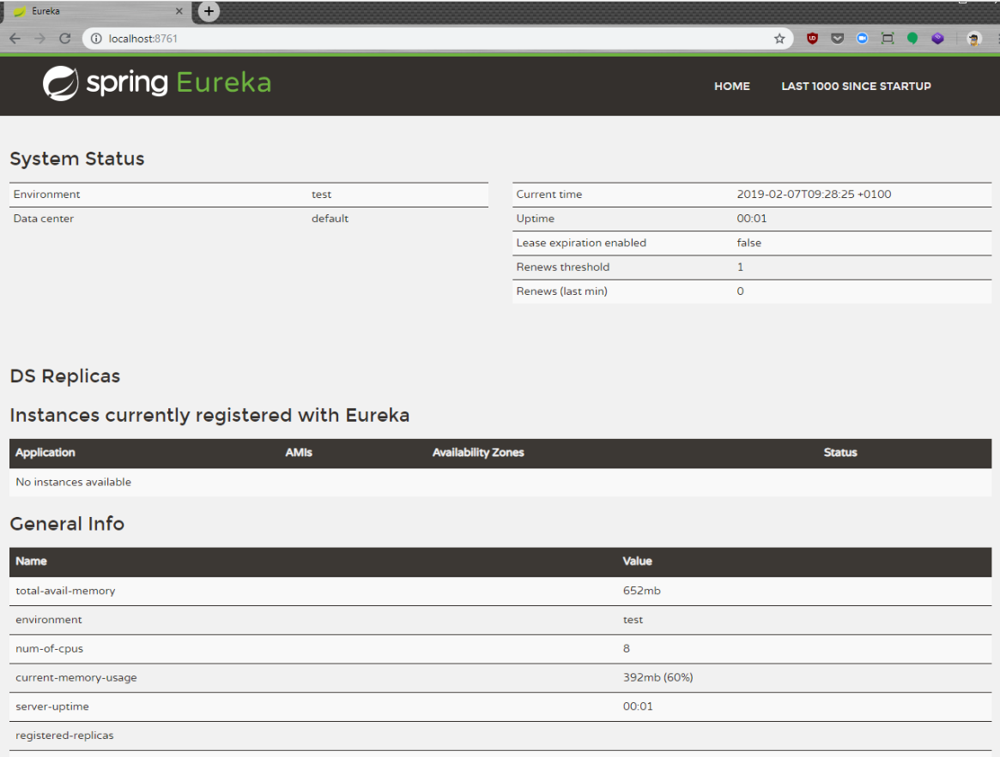
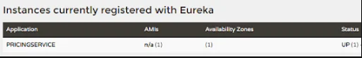

[TOC]

之前的部分:

1. [第1部分开发计划](https://github.com/amerina/NetCoreGrowthGuide/blob/main/ToolStep/MicroServiceBasic/Microservices/Article_CN/第1部分开发计划.md)
2. [第2部分用CQRS和MediatR塑造微服务内部架构](https://github.com/amerina/NetCoreGrowthGuide/blob/main/ToolStep/MicroServiceBasic/Microservices/Article_CN/第2部分用CQRS和MediatR塑造微服务内部架构.md)


### 什么是.Net Core微服务中的服务发现?

如果你正在构建基于微服务的解决方案，你迟早会遇到一个服务需要与另一个服务对话的情况。为了做到这一点，调用者必须知道他们所操作的网络中目标微服务的确切位置。

您必须以某种方式提供IP地址和端口，以便目标微服务侦听请求。您可以使用配置文件或环境变量来实现，但是这种方法有一些缺点和限制。

首先，您必须维护并正确部署所有环境的配置文件:本地开发、测试、预生产和生产环境。在添加新服务或将现有服务移动到不同的节点时忘记更新这些配置将导致在运行时发现错误。

其次，更重要的问题是，它只能在静态环境中工作，这意味着你不能动态地添加/删除节点，因此你不能动态地扩展你的系统。自主扩展和部署给定微服务的能力是基于微服务架构的关键优势之一，我们不想失去这种能力。

因此，我们需要引入**服务发现**。服务发现是一种允许服务查找彼此网络位置的机制。此模式有许多种实现，在本文中，我们将重点介绍由**服务注册中心组件**和**服务注册中心客户端**组成的实现。

Service Registry是一个维护微服务实例列表的中心组件，这些微服务实例当前在相应的网络位置上运行。服务注册客户端被你的微服务用于:在注册中心注册自己，查询注册中心需要与之通信的给定微服务的地址。

服务注册中心有许多现有的实现。不幸的是，我不知道任何原生的.NET解决方案。在Java世界中，Altkom Software在许多项目中使用两种解决方案:

- Netflix Eureka
- HashiCorp Consul

本文将使用Eureka，因为它有一个非常好的.NET Core客户端库，由Pivotal(Spring Framework的创建者)- Steeltoe开发和维护。

### 使用Eureka设置服务注册表

启动Eureka Server最简单的方法是克隆一个GitHub存储库，并使用[Maven包装器](https://github.com/takari/maven-wrapper)运行，该包装器附加到该项目。这允许您运行Maven项目，而无需在路径上安装和显示Maven。

我们将存储库克隆到eureka文件夹，在我们的例子中，这就足够了:

```powershell
cd eureka
mvnw spring-boot:run
```

Eureka服务器配置存储在一个application.yml文件中:

```yaml
server:
  port: 8761

eureka:
  client:
    registerWithEureka: false
    fetchRegistry: false
  server:
    waitTimeInMsWhenSyncEmpty: 0
```

如果您想检查Eureka是否正确启动，转到localhost:8761。你应该显示如下内容:




### 在Eureka注册微服务/注册Eureka客户端

我们使用Steeltoe的Eureka客户端实现从Eureka服务器注册和获取服务。在本节中，我们将重点讨论服务注册中心中的注册。这一切都是在我们的一个微服务——PricingService的例子上完成的。

#### 步骤1 -添加所需的包。

首先，让我们添加所需的NuGet包。

```powershell
dotnet add package Steeltoe.Discovery.ClientCore --version 2.1.1
```

#### 步骤2 -添加发现客户端

现在我们需要在Startup.cs类中添加发现客户端。这里必须添加两行，一行添加到ConfigureServices方法，另一行添加到Configure方法。

```c#
using Steeltoe.Discovery.Client;

namespace PricingService
{
    public class Startup
    {
        public Startup(IConfiguration configuration)
        {
            Configuration = configuration;
        }

        public IConfiguration Configuration { get; }

        public void ConfigureServices(IServiceCollection services)
        {
            services.AddDiscoveryClient(Configuration);
            [...]
        }

        public void Configure(IApplicationBuilder app, IHostingEnvironment env)
        {
           [...]
            app.UseDiscoveryClient();
        }
    }
}
```

#### 步骤3 -配置

最后一步也是最重要的一步是在appsettings.json中设置配置

```json
"spring" : {
    "application" : {
      "name" : "PricingService"
    }
  },
  "eureka" : {
    "client" : {
      "shouldRegisterWithEureka" : true,
      "serviceUrl" : "http://localhost:8761/eureka",
      "ValidateCertificates":  false
    },
    "instance" : {
      "appName" : "PricingService",
      "hostName" : "localhost",
      "port" : "5040”
    }
  }
```

配置包括以下几个部分:

- spring.application.name: 包含我们的服务名称
- eureka.client包含
  - shouldRegisterWithEureka:告知我们的服务是否应该在Eureka中注册，如果我们只想调用其他服务，我们可以把它设为false，如果我们想让其他服务能够调用我们的服务，我们必须把它设为true
  - serviceUrl：Eureka服务地址
  - instance：告知我们的服务应该如何在eureka注册，我们指定:
    - appName：使用此名称，其他服务将能够查询我们服务的地址
    - hostName：我们的服务正在运行的主机名
    - port：服务正在使用的端口

起初，我有点失望，因为我必须指定服务使用的主机名和端口，而不是Eureka客户端能够在运行时动态地发现这些信息，但这是一个非常有用的特性。

在docker容器中运行服务时，我们不希望它们在容器实例中注册本地的端口和地址，而是在docker网络中可见的地址和端口。关于配置选项的更多信息可以在[Steeltoe](https://steeltoe.io/docs/steeltoe-discovery/#1-2-2-eureka-client-settings)文档中找到。

#### 步骤4 -测试

现在我们可以使用命令行来运行微服务了。从根存储库文件夹:

```powershell
dotnet run --project ./PricingService
```

然后打开Eureka，看看你的服务是否可见。打开浏览器并转到localhost:8761




如果一切正常工作，服务的实例应该列在“当前注册到Eureka的实例”部分中。

#### 步骤5-监控

您可以创建运行状况检查端点，以便Eureka可以检查服务是否已启动并运行。这将通过Eureka仪表板实现对可用服务及其状态的几乎实时监控。

如果您实现了这样的端点，您可以使用**healthCheckUrl**配置属性指定它。

### 使用服务发现调用另一个微服务

我们的第一步是以与PricingService相同的方式添加Eureka客户端配置。

在前面的步骤之后，我们准备从另一个服务调用我们的服务。我们希望从PolicyService调用PricingService，因为在策略创建的一个步骤中，我们需要PricingService中关于价格的一些数据。

我们将结合Steeltoe发现客户端、[RestEase](https://github.com/canton7/RestEase)和[Polly](http://www.thepollyproject.org/)来为我们的PricingService创建一个漂亮的、声明性的、有弹性的客户端。

```c#
using Microsoft.Extensions.Configuration;
using Polly;
using PricingService.Api.Commands;
using RestEase;
using System;
using System.Net.Http;
using System.Threading.Tasks;
using Steeltoe.Common.Discovery;

namespace PolicyService.RestClients
{
    public interface IPricingClient
    {
        [Post]
        Task CalculatePrice([Body] CalculatePriceCommand cmd);
    }

    public class PricingClient : IPricingClient
    {
        private readonly IPricingClient client;

        private static Policy retryPolicy = Policy
            .Handle()
            .WaitAndRetryAsync(retryCount: 3, sleepDurationProvider: retryAttempt => TimeSpan.FromSeconds(3));

        public PricingClient(IConfiguration configuration, IDiscoveryClient discoveryClient)
        {
            var handler = new DiscoveryHttpClientHandler(discoveryClient);
            var httpClient = new HttpClient(handler, false)
            {
                BaseAddress = new Uri(configuration.GetValue("PricingServiceUri"))
            };
            client = RestClient.For(httpClient);
        }

        public Task CalculatePrice([Body] CalculatePriceCommand cmd)
        {
            return retryPolicy.ExecuteAsync(async () => await client.CalculatePrice(cmd));
        }
    }
}
```

我们声明了一个接口，该接口表示由PricingService公开的操作。

我们创建了这个接口的实现，该接口在内部使用服务发现客户端，该客户端将从Eureka中的服务注册中心获取PricingService的地址，结合Polly和restase。

这个例子中最重要的几行是handler和HTTP客户端创建:

```c#
var handler = new DiscoveryHttpClientHandler(discoveryClient);
var httpClient = new HttpClient(handler, false)
{
    BaseAddress = new Uri(configuration.GetValue("PricingServiceUri"))
};
```

我们使用appsettings.Json中配置的PricingService的URL，看起来像这样:

```json
"PricingServiceUri" : "http://PricingService/api/pricing"
```

如您所见，配置中的地址指向服务名称，而不是实际的网络地址。

最后一步是在IOC容器中注册客户端。为此，我们创建了一个名为RestClientsInstaller的类。

```c#
 public static class RestClientsInstaller
    {
        public static IServiceCollection AddPricingRestClient(this IServiceCollection services)
        {
            services.AddSingleton(typeof(IPricingClient), typeof(PricingClient));
...
            return services;
        }
    }
```

我们在Startup.cs中使用这个类

```c#
public void ConfigureServices(IServiceCollection services)
        {
            services.AddDiscoveryClient(Configuration);
            services.AddMvc().SetCompatibilityVersion(CompatibilityVersion.Version_2_1);
            services.AddMediatR();
            services.AddPricingRestClient();
            services.AddNHibernate(Configuration.GetConnectionString("DefaultConnection"));
            services.AddRabbit();
        }

```

现在您可以注入IPricingClient并使用它来调用PricingService。

### 微服务开发中的服务发现-概述

服务发现是微服务体系结构的基础之一。如果没有它，基于微服务架构的可靠定制软件开发就需要大量的手工和容易出错的工作。

使用Eureka和Steeltoe设置服务发现非常简单，并允许动态添加和删除服务实例。此外，它还消除了对需要通信的服务地址进行硬编码的需要。

查看完整的解决方案源代码:

[NetCoreGrowthGuide/ToolStep/MicroServiceBasic/Microservices](https://github.com/amerina/NetCoreGrowthGuide/tree/main/ToolStep/MicroServiceBasic/Microservices)

当然，这个解决方案只是在.net Core中实现服务发现机制构建微服务架构的可能方法之一。你也可以尝试Kubernetes, nginx或Consul的替代方法。


