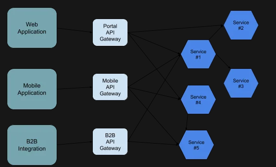
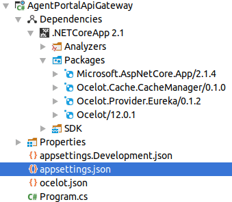

[TOC]

### 使用Ocelot构建API网关

这是关于在.NET Core上构建微服务的系列文章的第四篇。

在[第一篇文章]((https://github.com/amerina/NetCoreGrowthGuide/blob/main/ToolStep/MicroServiceBasic/Microservices/Article_CN/第1部分开发计划.md))中，我们介绍了该系列并列出了开发计划:业务用例和解决方案体系结构。

在[第二篇文章](https://github.com/amerina/NetCoreGrowthGuide/blob/main/ToolStep/MicroServiceBasic/Microservices/Article_CN/第2部分用CQRS和MediatR塑造微服务内部架构.md)中，我们描述了如何使用CQRS模式和MediatR库构建一个微服务的内部架构。

在[第三篇文章](https://github.com/amerina/NetCoreGrowthGuide/blob/main/ToolStep/MicroServiceBasic/Microservices/Article_CN/第3部分使用Eureka发现服务.md)中，我们描述了服务发现在基于微服务的架构中的重要性，并给出了Eureka的实际实现。

在本文中，我们将关注基于微服务架构的另一个基本概念——API网关。

完整解决方案的源代码可以在我们的[GitHub](https://github.com/amerina/NetCoreGrowthGuide/tree/main/ToolStep/MicroServiceBasic/Microservices)上找到。

#### 什么是API网关

基于微服务的方法的优点之一是：您可以用较小的服务组成庞大的系统，每个服务负责一个业务功能。当这种方法应用于大型和复杂的领域，如电子商务、保险或金融时，结果是由几十个微服务组成的解决方案。考虑到这个场景是动态的，当工作负载增加时启动服务的新实例，添加新服务，一些服务被分割成多个服务，可以想象如果你直接从客户端应用程序访问每个服务将是多么地困难。
API网关模式试图通过在客户端应用程序和后端服务之间添加单个交互点来解决从客户端应用程序访问个体服务的问题。API网关作为一个门面工作，对客户端隐藏了底层系统的复杂性。

API Gateway是另一个运行在后端服务之前的微服务，只公开给定客户端需要的操作。



API Gateway可以做的不仅仅是将客户端应用程序的请求路由到适当的后端服务。但是，您应该注意不要引入业务和流程逻辑，这可能会导致[API网关问题过于复杂](https://www.thoughtworks.com/radar/platforms/overambitious-api-gateways)。

除了路由之外，API网关通常负责安全。

我们通常不允许未经身份验证和未经授权的请求通过网关，因此网关有责任检查是否存在所需的安全令牌，是否有效，是否包含所需的声明。
下一件事是处理CORS。API Gateway必须准备好由运行单页应用程序的WEB浏览器访问，这些应用程序来自不同的API-Gateway来源。

API网关通常负责请求和响应转换，比如添加报头、更改请求格式以在客户端和服务器使用的数据表示之间转换。

最后但并不是最不重要的是API网关可用于更改通信协议。例如，您可以在API网关上将您的服务公开为HTTP REST，而这些调用则由API网关转换为gRPC。

在我们的IT公司，为每种类型的客户端应用程序构建单独的API网关是常见的做法。例如，如果我们有一个基于微服务的保险系统，我们将构建:一个独立的保险代理门户网关，一个独立的后台应用网关，一个独立的银行-保险集成网关，一个独立的终端客户移动应用网关。

#### 使用Ocelot构建API网关

在Java领域有许多构建API网关的解决方案，但是当我在.NET领域寻找解决方案时，除了从头开始构建自己的解决方案外，唯一可行的解决方案是Ocelot。这是一个非常有趣和强大的项目，甚至在[微软的官方示例](https://learn.microsoft.com/zh-cn/dotnet/architecture/microservices/multi-container-microservice-net-applications/implement-api-gateways-with-ocelot)中也使用。

让我们使用Ocelot为示例保险销售门户实现API Gateway。

##### 开始

我们从空ASP. NET Core应用程序开始。我们只需要Program.cs和appsettings.json文件。

我们首先使用nuget将Ocelot添加到我们的项目中。

```powershell
Install-Package Ocelot
```

在我们的项目中，我们也使用Ocelot服务发现和缓存特性，所以我们需要添加两个额外的NuGet包:

```powershell
Install-Package Ocelot.Provider.Eureka
Install-Package Ocelot.Cache.CacheManager
```

最后我们的解决方案应该如下图所示：



下一步我们需要添加ocelot.json文件来托管我们的Ocelot网关配置。

现在我们可以修改Program.cs以正确引导包含Ocelot所有必需的服务。

```c#
public class Program
{
   public static void Main(string[] args)
   {
       BuildWebHost(args).Run();
   }

   public static IWebHost BuildWebHost(string[] args)
   {  
       return WebHost.CreateDefaultBuilder(args)
           .UseUrls("http://localhost:8099")
           .ConfigureAppConfiguration((hostingContext, config) =>
           {
               config
                   .SetBasePath(hostingContext.HostingEnvironment.ContentRootPath)
                   .AddJsonFile("appsettings.json", true, true)
                   .AddJsonFile($"appsettings.{hostingContext.HostingEnvironment.EnvironmentName}.json", true,
                       true)
                   .AddJsonFile("ocelot.json", false, false)
                   .AddEnvironmentVariables();
           })
           .ConfigureServices(s =>
           {
               s.AddOcelot().AddEureka().AddCacheManager(x => x.WithDictionaryHandle());
           })
           .Configure(a =>
           {
              a.UseOcelot().Wait();
           })
           .Build();
   }
}
```

这里最重要的部分是:添加ocelot. json配置文件、添加Ocelot服务与Eureka和缓存管理器支持。

如果您还记得在本系列的前一部分中，我们使用Eureka作为服务注册表和发现机制。在这里，我们想要利用它并告诉Ocelot从Eureka解析下游服务URL，而不是硬编码它。

我们还使用Ocelot中的缓存支持来展示如何配置API网关来缓存同样缓慢变化的数据。

为了使所有这些工作正常进行，我们现在必须正确地填充配置文件。

让我们从appsettings.json文件开始，添加Eureka配置。

```json
{
  "spring": {
    "application": { "name": "Agent-Portal-Api-Gateway" }
  },
  "eureka": {
    "client": {
      "serviceUrl": "http://localhost:8761/eureka/",
      "shouldRegisterWithEureka": false,
      "validateCertificates": false
    }
  }
}
```

现在是时候修改ocelot. json文件——我们API网关的中心配置部分。ocelot. json由两个主要部分组成:ReRoutes和GlobalConfiguration。

- ReRoutes定义路由——将API网关公开的端点映射到后端服务。作为映射安全性的一部分，还可以定义缓存和转换。
- GlobalConfiguration定义了整个API网关的全局设置。

让我们从GlobalConfiguration开始:

```json
"GlobalConfiguration": {
    "RequestIdKey": "OcRequestId",
    "AdministrationPath": "/administration",
    "UseServiceDiscovery" : true,
    "ServiceDiscoveryProvider": { "Type": "Eureka", "Host" : "localhost", "Port" : "8761"}
  }
```

这里的关键配置是：启用服务发现和指向正确的Eureka实例。

现在我们可以定义路由了。让我们定义第一个路由，将到达api-gateway的HTTP GET请求/Products/{code}映射到下游服务ProductService，该服务将产品数据公开为HTTP GET [serviceHost:port]/api/Products/{code}。

```json
"ReRoutes": [
    {
      "DownstreamPathTemplate": "/api/Products/{everything}",
      "DownstreamScheme": "http",
      "UpstreamPathTemplate": "/Products/{everything}",
      "ServiceName": "ProductService",
      "UpstreamHttpMethod": [ "Get" ]
    }
]
```

- DownstreamPathTemplate指定后端服务URL
- UpstreamPathTemplate指定API网关公开的URL
- Downstream and Upstream Schema指定模式
- ServiceName指定下游服务在Eureka中注册的名称。

让我们看另一个例子。这一次，我们将配置offer创建服务，PolicyService将其公开为HTTP POST [serviceHost:port]/api/offer

```json
{
      "DownstreamPathTemplate": "/api/Offer",
      "DownstreamScheme": "http",
      "UpstreamPathTemplate": "/Offers",
      "ServiceName": "PolicyService",
      "UpstreamHttpMethod": [ "Post" ]
 }
```

#### Ocelot的高级功能

##### Cors

这与Ocelot本身无关，但它通常需要在API网关层支持跨源请求。我们需要修改我们的Program.cs类ConfigureServices()方法:

```c#
s.AddCors();
```

在Configure()方法中，我们需要添加:

```c#
a.UseCors(b => b
          .AllowAnyOrigin()
          .AllowAnyMethod()
          .AllowAnyHeader()
          .AllowCredentials()
);
```

##### 安全

接下来，我们将在API网关中添加基于JWT令牌的安全性。这样，未经身份验证的请求将不会通过我们的API网关。
在BuildWebHost方法中，我们需要添加一个用于JWT验证的键。在实际应用中，您应该将这个密钥存储在一个安全的秘密存储中，但为了演示目的，让我们只创建一个变量。

```c#
var key = Encoding.ASCII.GetBytes("THIS_IS_A_RANDOM_SECRET_2e7a1e80-16ee-4e52-b5c6-5e8892453459");
```

现在我们需要在ConfigureService()中设置安全性:

```c#
s.AddAuthentication(x =>
{
     x.DefaultAuthenticateScheme = JwtBearerDefaults.AuthenticationScheme;
     x.DefaultChallengeScheme = JwtBearerDefaults.AuthenticationScheme;    
})
.AddJwtBearer("ApiSecurity", x =>
{
      x.RequireHttpsMetadata = false;
      x.SaveToken = true;
      x.TokenValidationParameters = new TokenValidationParameters
      {
           ValidateIssuerSigningKey = true,
           IssuerSigningKey = new SymmetricSecurityKey(key),
           ValidateIssuer = false,
           ValidateAudience = false
       };
});
```

有了这些设置，我们现在可以回到ocelot. json并为我们的路由定义安全需求。

在本例中，我们要求用户经过身份验证，令牌包含声明userType且值为SALESMAN。

让我们看看如何配置:

```c#
{
      "DownstreamPathTemplate": "/api/Products",
      "DownstreamScheme": "http",
      "UpstreamPathTemplate": "/Products",
      "ServiceName": "ProductService",
      "UpstreamHttpMethod": [ "Get" ],
      "FileCacheOptions": { "TtlSeconds": 15 },
      //配置身份验证
      "AuthenticationOptions": {
        "AuthenticationProviderKey": "ApiSecurity",
        "AllowedScopes": []
      },
      //配置Claim要求
      "RouteClaimsRequirement": {
        "userType" : "SALESMAN"
      }
    }
```

我们添加了AuthenticationOptions部分，将Program.cs中定义的身份验证机制与Ocelot链接起来，然后在RouteClaimsRequirement中指定必须提供哪个声明和哪个值，以便将请求传递给后端服务。

##### 服务发现

我们已经介绍了Eureka在服务发现方面的用法。你不必使用服务发现，可以使用硬编码的URL将上游请求映射到后端服务，但这将消除基于微服务架构的许多优势，并使你的部署和操作非常复杂，因为你必须保持后端微服务URL与ocelot配置同步。
除了Eureka, Ocelot还支持其他服务发现机制:Consul和Kubernetes。

你可以在[Ocelot服务发现文档](https://ocelot.readthedocs.io/en/latest/features/servicediscovery.html)获取更多信息。

##### 负载均衡

Ocelot提供内置的负载均衡器，可以为每条路由配置负载均衡器。有四种可用的类型:最少连接、轮询、Cookie粘滞会话、第一个可用服务。

你可以在[Ocelot文档](https://ocelot.readthedocs.io/en/latest/features/loadbalancer.html)中阅读更多信息。

##### 缓存

Ocelot提供了开箱即用的简单缓存实现。一旦你包含Ocelot.Cache.CacheManager包并激活它

```c#
s.AddOcelot()
    .AddCacheManager(x => { x.WithDictionaryHandle(); })
```

您可以为每条路由配置缓存。举个例子，让我们为获取给定产品代码的产品定义的路由添加缓存:

```c#
{
      "DownstreamPathTemplate": "/api/Products/{everything}",
      "DownstreamScheme": "http",
      "UpstreamPathTemplate": "/Products/{everything}",
      "ServiceName": "ProductService",
      "UpstreamHttpMethod": [ "Get" ],
      //配置缓存
      "FileCacheOptions": { "TtlSeconds": 15 },
      "AuthenticationOptions": {
        "AuthenticationProviderKey": "ApiSecurity",
        "AllowedScopes": []
      },
      "RouteClaimsRequirement": {
        "userType" : "SALESMAN"
      }
    }
```

这个配置告诉Ocelot缓存给定请求的结果15秒。

Ocelot还让你能够以插件方式使用自己的缓存，扩展Ocelot简单的缓存实现更强大的选项，如Redis或Memcache。

您可以在[Ocelot缓存文档](https://ocelot.readthedocs.io/en/latest/features/caching.html)中阅读更多关于它的信息。

##### 速率限制

Ocelot支持速率限制。该特性可以帮助您防止下游服务过载。通常情况下，您可以根据路由配置速率限制。为了启用速率限制，你需要添加以下json到你的路由:

```json
"RateLimitOptions": {
    //客户端白名单
    "ClientWhitelist": [],
    "EnableRateLimiting": true,
    "Period": "1s",
    "PeriodTimespan": 1,
    "Limit": 1
}
```

- ClientWhiteList允许您指定不应该限制哪些客户端
- EnableRateLimiting启用速率限制
- Period配置限制适用的时间段(可以以秒、分钟、小时或天为单位指定)
- Limit配置给定时间段内允许的请求数量。如果在给定的时间段内客户端超过了Limit中指定的请求数量，那么他们必须在另一个请求传递给下游服务之前等待PeriodTimespan。

##### 转换

Ocelot允许我们配置Header和Claim转换。您可以为请求和响应添加Header。除了静态值，你还可以使用占位符:

- {RemoteIpAddress}客户端IP地址
- {BaseUrl} ocelot基本URL
-  {DownstreamBaseUrl}下游服务基本URL
- {TraceId} Butterfly跟踪ID(如果你使用[Butterfly分布式跟踪](https://github.com/liuhaoyang/butterfly))
- 您还可以查找和替换header值

Ocelot还允许您访问Claims并将其转换为Header、查询字符串参数或其他Claims。当您需要将有关授权用户的信息传递给后端服务时，这非常有用。与往常一样，您可以基于路由指定这些转换。
在下面的例子中，您可以看到如何提取子Claims并将其放在CustomerId Header中。

```json
"AddHeadersToRequest": {
    "CustomerId": "Claims[sub] > value[1] > |"
}
```

您可以在 [Ocelot Header转换文档](https://ocelot.readthedocs.io/en/latest/features/headerstransformation.html) 和[Ocelot Claim转换文档](https://ocelot.readthedocs.io/en/latest/features/claimstransformation.html)中阅读有关此主题的更多信息。

#### 总结

Ocelot为我们提供了功能丰富的API网关实现，几乎不需要编码。您必须执行的大部分工作都与正确定义公开API网关端点和后端服务URL之间的路由有关。您可以轻松地添加身份验证和授权支持以及缓存。

除了本文描述的特性，Ocelot还支持请求聚合、日志记录、Web Sockets、[Butterfly](https://github.com/liuhaoyang/butterfly)项目分布式跟踪和委托处理程序。

你可以查看完整的解决方案源代码:[MircoService](https://github.com/amerina/NetCoreGrowthGuide/tree/main/ToolStep/MicroServiceBasic/Microservices)