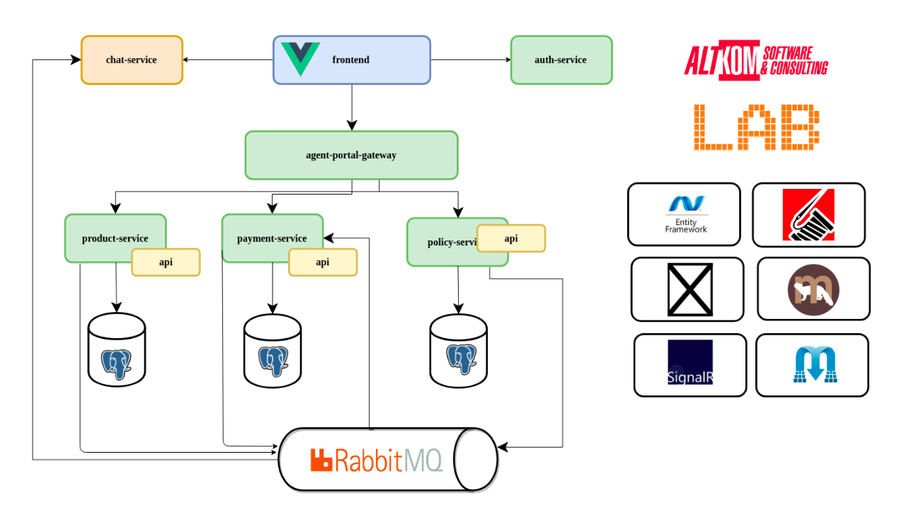

[TOC]

### 实时服务器客户端与SignalR和RabbitMQ通信

这是关于在.NET Core上构建微服务的系列文章的第五篇。

在[第一篇文章](https://github.com/amerina/NetCoreGrowthGuide/blob/main/ToolStep/MicroServiceBasic/Microservices/Article_CN/第1部分开发计划.md)中，我们介绍了该系列并列出了开发计划:业务用例和解决方案体系结构。

在[第二篇文章](https://github.com/amerina/NetCoreGrowthGuide/blob/main/ToolStep/MicroServiceBasic/Microservices/Article_CN/第2部分用CQRS和MediatR塑造微服务内部架构.md)中，我们描述了如何使用CQRS模式和MediatR库构建一个微服务的内部架构。

在[第三篇文章](https://github.com/amerina/NetCoreGrowthGuide/blob/main/ToolStep/MicroServiceBasic/Microservices/Article_CN/第3部分使用Eureka发现服务.md)中，我们描述了服务发现在基于微服务的架构中的重要性，并给出了Eureka的实际实现。

在[第四篇文章](https://github.com/amerina/NetCoreGrowthGuide/blob/main/ToolStep/MicroServiceBasic/Microservices/Article_CN/第4部分用Ocelot构建API网关.md)中，我们介绍了如何使用Ocelot为微服务构建API网关。

在[第五篇文章](https://github.com/amerina/NetCoreGrowthGuide/blob/main/ToolStep/MicroServiceBasic/Microservices/Article_CN/第5部分为你的领域聚合创建一个理想的存储库.md)中，主要介绍了利用Marten库实现数据访问。

**在本文中，我们将向您展示如何结合SignalR和RabbitMQ来构建实时服务器-客户端通信。我们将通过聊天服务扩展我们的保险销售门户。这个聊天可以让保险代理人相互交流。我们还将使用此聊天服务向用户发送有关某些业务事件的信息，如新产品的可用性、成功销售或保险产品或关税变化。**

完整解决方案的源代码可以在我们的[GitHub](https://github.com/amerina/NetCoreGrowthGuide/tree/main/ToolStep/MicroServiceBasic/Microservices)上找到。

### 我们要构建什么?

在我们现有的基于微服务的保险销售系统中，我们将添加一个聊天服务。

这个聊天服务有两个功能:

- 它将允许保险代理人使用我们的应用程序相互交谈，
- 它将允许我们的系统在重要业务事件发生时发送通知，此类事件的例子是新产品或关税的引入，成功销售，佣金计算或收到付款。



我们从常规的.NET Web API应用程序开始，但这次我们将使用.Net Core2.2版本，这将产生重大的影响。像往常一样，我们添加MediatR。在实现聊天服务之前，我们需要保护我们的服务并设置CORS。

我们将使用基于JWT令牌的方法确保对新服务的访问安全。

我们需要在Startup类中通过向Configure和ConfigureServices方法添加代码来设置它。下面是显示关键配置部分的代码片段:

```c#
var appSettings = appSettingsSection.Get();
var key = Encoding.ASCII.GetBytes(appSettings.Secret);

services
	.AddAuthentication(x =>
	{
	    x.DefaultAuthenticateScheme = JwtBearerDefaults.AuthenticationScheme;
	    x.DefaultChallengeScheme = JwtBearerDefaults.AuthenticationScheme;    
	})
	.AddJwtBearer(x =>
	{
	    x.TokenValidationParameters = new TokenValidationParameters
	    {
            ValidateIssuerSigningKey = true,
            IssuerSigningKey = new SymmetricSecurityKey(key),
            ValidateIssuer = false,
            ValidateAudience = false,
            ValidateActor = false
	    };
	    x.Events = new JwtBearerEvents
	    {
            OnMessageReceived = context =>
            {
                var accessToken = context.Request.Query["access_token"];

                var path = context.HttpContext.Request.Path;
                if (!string.IsNullOrEmpty(accessToken) &&
                    (path.StartsWithSegments("/agentsChat")))
                {
                    context.Token = accessToken;
                }
                return Task.CompletedTask;    
            }
	    };
	});
```

这是典型的JWT设置，Secret存储在配置文件中。唯一不寻常的事情是*OnMessageReceived*，这是SignalR正常工作所需要的(你可以在[这里](https://learn.microsoft.com/en-us/aspnet/core/signalr/authn-and-authz?view=aspnetcore-7.0&viewFallbackFrom=aspnetcore-2.2)找到更多信息)。

接下来是CORS设置。在.NET Core 2.2中，我们有一个突破性的变化。我们不再允许有公共API(一个与*AllowAnyOrigin*)与*AllowCredentials*结合。
这就是为什么我们需要在配置中指定所有允许的客户端。在配置中列出客户端:

```json
"AppSettings": {
    "AllowedChatOrigins" : ["http://localhost:8080"]
}
```

我们现在可以配置CORS:

```c#
services.AddCors(opt => opt.AddPolicy("CorsPolicy",
	builder =>
	{
		Builder
			.AllowAnyHeader()
			.AllowAnyMethod()
			.AllowCredentials()
			.WithOrigins(appSettingsSection.Get().AllowedChatOrigins);
	}
));
```

### 用SignalR构建聊天服务

#### 什么是SignalR?

SignalR是一个允许.NET开发者向WEB应用程序添加实时通信的库。它能够从已连接的客户机接收消息，并从服务器向客户机发送通知。

除了服务器端实现，你还可以找到大多数流行平台的客户端实现:JavaScript、Java、.NET和.NET Core。

#### 添加到项目

现在我们可以将SignalR添加到我们的项目中。第一步是将它添加到Startup类ConfigureServices方法:

```c#
services.AddSignalR();
```

接下来，我们需要添加一个集线器Hub，它是服务器和客户端之间的通信中心点。这很简单。您只需要添加一个继承Hub的类。

```c#
[Authorize(AuthenticationSchemes = JwtBearerDefaults.AuthenticationScheme)]
public class AgentChatHub : Hub
```

我们还添加了Authorize属性并指定SignalR应该使用哪个身份验证模式。

我们还需要提供一个服务，根据当前的用户主体为SignalR提供“user name”。为此，我们需要实现*IUserIdProvider*并注册这个实现。

```c#
public class NameUserIdProvider : IUserIdProvider
{
	public string GetUserId(HubConnectionContext connection)
	{
		return connection.User?.Identity?.Name;
	}
}

//Startup.cs ConfigureServices
services.AddSingleton<IUserIdProvider, NameUserIdProvider>();
```

最后一步是为我们的Hub添加URL映射。我们需要把它添加到Startup类的Configure方法中:

```c#
app.UseSignalR(routes =>
{
	routes.MapHub("/agentsChat");
});
```

现在，提供有效JWT令牌并在*AllowedChatOrigins*配置设置中列出的客户端可以从外部世界访问我们的Hub。

#### Hub

SignalR Hub允许客户端向服务器发送消息，反之亦然。Hub维护连接的客户端列表，并允许服务器端代码在客户端上“执行”方法。

现在我们将*SendMessage*方法添加到我们的[*AgentChatHub*](https://github.com/amerina/NetCoreGrowthGuide/blob/main/ToolStep/MicroServiceBasic/Microservices/ChatService/Hubs/AgentChatHub.cs)中。当其中一个代理想要向当前连接的所有用户发送消息时，客户端SPA应用程序将调用此方法。

```c#
public async Task SendMessage(string message)
{
    //获取用户头像
	var avatar = Context.User?.Claims?.FirstOrDefault(c=>c.Type=="avatar")?.Value;
            
	await Clients.All.SendAsync("ReceiveMessage", Context.User?.Identity?.Name, avatar, message);
}
```

该方法从认证的用户数据中提取一些信息，并调用所有客户端“ReceiveMessage”，传递用户名、头像和消息。

Hub还对用户连接或断开连接等事件做出反应。下面您可以找到向所有用户广播有关此类事件的信息的简单方法。

```c#
public override async Task OnConnectedAsync()
{
	await Clients.Others.SendAsync("ReceiveNotification", $"{Context.User?.Identity?.Name} join chat");
}

public override async Task OnDisconnectedAsync(Exception exception)
{
	await Clients.Others.SendAsync("ReceiveNotification", $"{Context.User?.Identity?.Name} left chat");
}
```

#### 使用VueJS实现客户端

要从VueJS中使用SignalR，我们需要使用npm安装适当的包。

```json
"dependencies": {
	"@aspnet/signalr": "^1.1.2",
	…
}
```

现在我们可以添加实现发送消息和处理来自服务器的新消息。大多数有趣的代码都位于[**Chat.vue**](https://github.com/amerina/NetCoreGrowthGuide/blob/main/ToolStep/MicroServiceBasic/Microservices/Web/src/components/Chat.vue)组件中。

我们需要连接到Hub。这发生在*created* 处理程序中:

```javascript
this.hubConnection
	.start()
	.then(()=>console.info("connected to hub"))
	.catch(err => console.error(err));
```

我们还需要为服务器发送的事件注册侦听器

```javascript
this.hubConnection.on("ReceiveMessage",(usr, avatar,msg) => {
	this.appendMsgToChat(usr,avatar,msg);
});

this.hubConnection.on("ReceiveNotification", msg => {
	this.appendAlertToChat(msg);
});
```

唯一缺少的部分是向我们的Hub发送消息的方法:

```javascript
send() {       
	this.hubConnection.invoke("SendMessage", this.message);
	this.message = '';
}
```

下面是一个正在运行的应用程序的截图:


### RabbitMQ的发布-订阅实现

RabbitMQ是一种轻量级、易于使用和操作的开源消息代理。ASC LAB团队至少6年在许多项目中使用它。它可以用于与发布者-订阅者模式异步集成系统组件，也可以用作RPC机制。

对于使用.NET Core的RabbitMQ，我们推荐[RawRabbit](https://github.com/pardahlman/RawRabbit)库。

在我们开始实现发布订阅解决方案之前，我们必须安装RabbitMQ。大多数流行操作系统的安装说明可以在[官方文档页面](https://www.rabbitmq.com/download.html)上找到。

一旦RabbitMQ启动并运行，我们就可以开始实现我们的解决方案了。

#### 发布事件

我们将添加向*PolicyService*发布领域事件的功能。当有人购买或终止策略时，我们将向RabbitMQ发送消息，以便其他对此类事件感兴趣的微服务能够做出反应。例如，*PaymentService*可能会为刚刚售出的保单创建一个帐户，并在保单终止时关闭该帐户。

在这篇文章中，我们将看到*ChatService*如何订阅正在出售的新策略事件，以及如何使用SignalR通知当前登录的用户。

要使用*RawRabbit*实现事件发布，我们需要添加以下NuGet包：

```json
<PackageReference Include="RawRabbit.DependencyInjection.ServiceCollection" Version="2.0.0-rc5" />
<PackageReference Include="RawRabbit.Operations.Tools" Version="2.0.0-rc5" />
```

现在我们可以配置*RawRabbit*库了。我们将配置封装在[RawRabbitInstaller](https://github.com/amerina/NetCoreGrowthGuide/blob/main/ToolStep/MicroServiceBasic/Microservices/PolicyService/Messaging/RabbitMq/RawRabbitInstaller.cs)类中。

```c#
services.AddRawRabbit(new RawRabbitOptions
{
	ClientConfiguration = new RawRabbit.Configuration.RawRabbitConfiguration
	{
	    Username = "guest",
	    Password = "guest",
	    VirtualHost = "/",
	    Port = 5672,
	    Hostnames = new List {"localhost"},
	    RequestTimeout = TimeSpan.FromSeconds(10),
	    PublishConfirmTimeout = TimeSpan.FromSeconds(1),
	    RecoveryInterval = TimeSpan.FromSeconds(1),
	    PersistentDeliveryMode = true,
	    AutoCloseConnection = true,
	    AutomaticRecovery = true,
	    TopologyRecovery = true,
	    Exchange = new RawRabbit.Configuration.GeneralExchangeConfiguration
	    {
            Durable = true,
            AutoDelete = false,
            Type = RawRabbit.Configuration.Exchange.ExchangeType.Topic
	    },
	    Queue = new RawRabbit.Configuration.GeneralQueueConfiguration
	    {
            Durable = true,
            AutoDelete = false,
            Exclusive = false
	    }
	}
});
```

在这里，我们配置代理地址、连接的用户凭据、交换机和队列默认设置。对于生产解决方案，我们应该将这些参数移到系统配置中。

有了这些，我们可以注册publisher的实现，这将用于我们的代码库。

```c#
services.AddSingleton<IEventPublisher,RabbitEventPublisher>();
```

当然，我们必须在ConfigureServices方法的[Startup](https://github.com/amerina/NetCoreGrowthGuide/blob/main/ToolStep/MicroServiceBasic/Microservices/PolicyService/Startup.cs)类中添加Rabbit service:

```c#
services.AddRabbit();
```

这是publisher代码:

```c#
public class RabbitEventPublisher : IEventPublisher
{
	private readonly IBusClient busClient;

	public RabbitEventPublisher(IBusClient busClient)
	{
		this.busClient = busClient;
	}

	public Task PublishMessage(T msg)
	{
		return busClient.BasicPublishAsync(msg, cfg => {
			cfg.OnExchange("lab-dotnet-micro").WithRoutingKey(typeof(T).Name.ToLower());
		});
	}
}
```

它注入RawRabbit库中的busClient，并使用busClient发送名为lab-dotnet-micro的消息交换，路由键等于消息类名，内容是消息类型的实例。

例如，我们有*PolicyCreated*类，它表示出售新策略的事件。如果我们选择*publisher.PublishMessage*(new PolicyCreated{…})一个带有路由键*PolicyCreated*和内容是PolicyCreated类的JSON序列化的消息将被发送到lab-dotnet-micro 交换机。

我们现在可以修改[CreatePolicyHandler](https://github.com/amerina/NetCoreGrowthGuide/blob/main/ToolStep/MicroServiceBasic/Microservices/PolicyService/Commands/CreatePolicyHandler.cs)以在新策略被出售时发送事件。

我们需要添加*IEventPublisher*依赖，并使用它来发送事件。

```c#
public async Task Handle(CreatePolicyCommand request, CancellationToken cancellationToken)
{
	using (var uow = uowProvider.Create())
	{
		var offer = await uow.Offers.WithNumber(request.OfferNumber);
		var customer =  ….
		var policy = offer.Buy(customer);

		uow.Policies.Add(policy);
		await uow.CommitChanges();

		await eventPublisher.PublishMessage(PolicyCreated(policy));

		return new CreatePolicyResult
		{
			PolicyNumber = policy.Number
		};    
	}
}

private PolicyCreated PolicyCreated(Policy policy)
{
	return new PolicyCreated
	{
		PolicyNumber = policy.Number,
	    	…
	};
}
```

#### 监听事件并向用户发送SignalR通知

现在，当publishing部分准备就绪时，我们可以在*ChatService*中实现*PolicyCreated*事件的侦听器。

首先，我们需要在[ChatService.csproj](https://github.com/amerina/NetCoreGrowthGuide/blob/main/ToolStep/MicroServiceBasic/Microservices/ChatService/ChatService.csproj)中添加以下包NuGet依赖项。

```json
<PackageReference Include="RawRabbit.DependencyInjection.ServiceCollection" Version="2.0.0-rc5" />
<PackageReference Include="RawRabbit.Operations.Subscribe" Version="2.0.0-rc5" />
```

现在我们可以配置到RabbitMQ的连接并配置侦听器。连接配置与发布者部分相同。你可以在ChatService的[RawRabbitInstaller](https://github.com/amerina/NetCoreGrowthGuide/blob/main/ToolStep/MicroServiceBasic/Microservices/PolicyService/Messaging/RabbitMq/RawRabbitInstaller.cs)中找到它。

在详细讨论如何实现消息订阅之前，我们需要稍微讨论一下解决方案中的体系结构原则。到目前为止，我们使用命令和查询处理程序来封装领域逻辑并对外公开。这些命令和查询是使用Web API控制器公开的。

在这方面，我们的架构是基于MediatR的。为了保持一致性，我们还将使用MediatR来处理消息。MediatR有*INotification*和*INotificationHandler*接口的定义。第一个用于标记事件或消息类，第二个用于实现给定通知类型(事件/消息类型)的处理程序。

您可能已经看到*[PolicyCreated](https://github.com/amerina/NetCoreGrowthGuide/blob/main/ToolStep/MicroServiceBasic/Microservices/PolicyService.Api/Events/PolicyCreated.cs)*类被标记为*INotification* 接口。

下面您可以看到[PolicyCreated](https://github.com/amerina/NetCoreGrowthGuide/blob/main/ToolStep/MicroServiceBasic/Microservices/ChatService/Listeners/PolicyCreatedHandler.cs)通知的处理程序。

```c#
public class PolicyCreatedHandler : INotificationHandler
{
	private readonly IHubContext chatHubContext;

	public PolicyCreatedHandler(IHubContext chatHubContext)
	{
		this.chatHubContext = chatHubContext;
	}

	public async Task Handle(PolicyCreated notification, CancellationToken cancellationToken)
	{
		await chatHubContext.Clients.All.SendAsync("ReceiveNotification",$"{notification.AgentLogin} just sold policy for {notification.ProductCode}!!!");
	}
}
```

在这里，您可以看到我们使用AgentChatHub的注入实例向所有已连接的用户发送消息，该消息表明代理已出售给定类型的策略。通过这种方式，我们将SignalR与来自其他微服务的消息结合起来。但是我们仍然没有看到如何将MediatR通知处理程序与RabbitMQ消息粘合在一起。

让我们分析一下[RabbitEventListener](https://github.com/amerina/NetCoreGrowthGuide/blob/main/ToolStep/MicroServiceBasic/Microservices/ChatService/Messaging/RabbitMq/RabbitEventListener.cs)和[RabbitListenersInstaller](https://github.com/amerina/NetCoreGrowthGuide/blob/main/ToolStep/MicroServiceBasic/Microservices/ChatService/Messaging/RabbitMq/RawRabbitInstaller.cs)类。让我们来看看RabbitEventListener ListenTo方法是做什么的

```c#
public void ListenTo(List eventsToSubscribe)
{
	foreach (var evtType in eventsToSubscribe)
	{
		This.GetType()
			.GetMethod("Subscribe", 
				System.Reflection.BindingFlags.NonPublic|
				System.Reflection.BindingFlags.Instance)
			.MakeGenericMethod(evtType)
			.Invoke(this, new object[] { });
	}
}
```

此方法接受一个类型列表，这些类型表示我们想要侦听的消息。我们遍历这个列表，对于每种类型，我们调用Subscribe&lt;T&gt;方法。这是实际工作完成的地方。

```c#
private void Subscribe() where T : INotification
{
	this.busClient.SubscribeAsync(
	async (msg) =>
	{
		using (var scope = serviceProvider.CreateScope())
		{
			var internalBus = scope.ServiceProvider.GetRequiredService();
			await internalBus.Publish(msg);
		}
	},
	cfg => cfg.UseSubscribeConfiguration(
		c => c
		.OnDeclaredExchange(e => e
			.WithName("lab-dotnet-micro")
			.WithType(RawRabbit.Configuration.Exchange.ExchangeType.Topic)
			.WithArgument("key", typeof(T).Name.ToLower()))
			.FromDeclaredQueue(q => q.WithName("lab-chat-service-" + typeof(T).Name)))
	);
}
```

在这里，我们连接到交换机lab-dotnet-micro，并声明一个队列，该队列将收集路由键等于事件类型名称的消息。队列名称是*lab-chat-service*加上事件类型名称。
当具有此key的消息到达交换机时，它被放置在队列中。当我们的ChatService启动并运行时，它将收到这条消息

```c#
using (var scope = serviceProvider.CreateScope())
{
	var internalBus = scope.ServiceProvider.GetRequiredService();
	await internalBus.Publish(msg);
}
```

代码将被执行。
这段代码解析IMediator并使用它路由到适当的已注册的*INotificationHandler*。

请记住，我们通过ASP.NET Core依赖注入使用MediatR，因此我们不需要做任何额外的步骤(除了在我们的[Startup](https://github.com/amerina/NetCoreGrowthGuide/blob/main/ToolStep/MicroServiceBasic/Microservices/ChatService/Startup.cs)类中调用services.AddMediatR())来注册我们的*PolicyCreatedHandler*。

所以我们只需要注册我们想要处理的消息类型，这样*RabbitEventListener*就会启动一个队列并开始订阅。
我们通过在Startup类的Configure方法中添加以下代码来实现:

```c#
app.UseRabbitListeners(new List<Type> {typeof(PolicyCreated)});
```

这样，如果你想处理几种类型的消息，例如PolicyTerminated, ProductActivated，我们需要做的就是:

- 为给定类型创建INotificationHandler
- 将它添加到传递给UserRabbitListeners的类型列表中


### 总结

**正如你所看到的，在SignalR和RawRabbit的帮助下，我们可以实现相当复杂的功能。将MadiatR与前面提到的组件相结合可以使我们的业务逻辑代码远离基础设施问题，并帮助我们保持整个解决方案的干净架构。**

我们还为我们的解决方案增加了巨大的业务价值。现在我们的保险代理人可以互相交谈，他们还可以得到各种业务事件的实时通知。

你可以查看完整的解决方案源代码:[MircoService](https://github.com/amerina/NetCoreGrowthGuide/tree/main/ToolStep/MicroServiceBasic/Microservices)