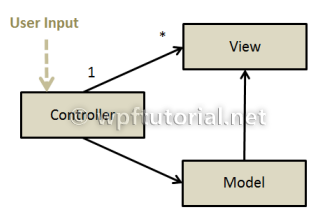
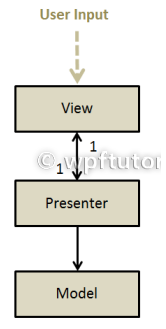
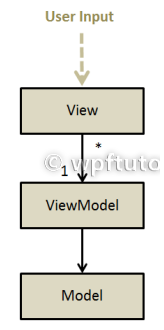

[TOC]

### 模型-视图-视图模型模式

原文:[WPF Tutorial | Model-View-ViewModel Pattern](https://www.wpftutorial.net/MVVM.html)

#### MVVM模式为何如此便捷

WPF有一个非常强大的数据绑定特性，它提供了一个简单的单向或双向属性同步。您可以直接将两个WPF元素绑定在一起，但数据绑定的常见用法是将某种数据绑定到视图。这是通过使用**DataContext**属性来完成的。由于DataContext属性被标记为继承的，因此可以在视图的根元素上设置它，并且它的值将继承到视图的所有下级元素。

使用**DataContext**属性作为数据源的一个很大的限制是，它只有一个。但在实际项目中，每个视图通常有多个数据对象。那么我们能做什么呢?**最明显的方法是将所有数据对象聚合到一个可以绑定到DataContext对象中，该对象将聚合的数据作为属性公开。这个对象称为视图模型。**

#### 逻辑和展示层的分离

到目前为止，MVVM模式只是一种将数据绑定到视图的方便方法。但是用户操作是如何处理的呢?WinForms的经典方法是注册一个事件处理程序，该处理程序在视图的后台代码文件中实现。这样做有一些缺点:

- 在后台代码中使用事件处理程序不利于测试，因为您无法模拟视图。
- 更改视图的设计通常也需要更改代码，因为每个元素都有不同的事件处理程序。
- 逻辑与视图紧密绑定。在其他视图中重用逻辑是不可能的

因此，我们的想法是通过使用WPF的另一个特性，即命令(**Commands**)，将整个表示逻辑移到视图模型中。**命令可以像数据一样绑定，并且许多元素都支持它**，如按钮、切换按钮、菜单项、复选框和输入绑定。这里的目标是在视图的后台代码中不包含任何逻辑行。这将为您带来以下优势

- 通过使用标准单元测试(而不是UI测试)可以轻松地测试视图模型。
- 视图可以在不改变视图模型的情况下重新设计，因为界面保持不变。
- 在某些特殊情况下，视图模型甚至可以被重用(通常不建议这样做)

#### MVVM、MVP和MVC有什么区别?

对于MVP、MVC和MVVM模式之间的区别，人们总是感到困惑。所以我试着更清楚地定义和区分它们。

#### MVC -模型-视图-控制器

MVC模式由一个直接获取所有用户输入的控制器组成。根据输入类型的不同，他会显示不同的视图或修改模型中的数据。模型和视图是由控制器创建的。视图只知道模型，但模型不知道任何其他对象。这个模式经常被用在老式的MFC和现在的ASP.NET MVC中。

#### MVP -模型-视图-展示器

在MVP模式中，视图获取用户输入并将其转发给展示器。展示器然后根据用户操作的类型修改视图或模型。视图和展示器是紧密耦合的。它们之间是双向一对一的关系。模型不知道展示器。视图本身是被动的，这就是为什么它被称为展示器模式，因为展示器将数据推入视图。这种模式经常出现在WinForms和早期WPF应用程序中。

#### MVVM - 模型-视图-视图模型

模型-视图-视图模型是典型的WPF模式。它包括一个视图，该视图获取所有用户输入并将其转发给视图模型，通常使用命令。视图通过使用数据绑定主动地从视图模型中提取数据。模型不知道视图模型。

#### 一些MVVM框架

- [PRISM (Microsoft)](https://prismlibrary.com/docs/)
- [MVVM Light (Laurent Bugnion)](https://github.com/lbugnion/mvvmlight)
- [WPF Application Framework](https://github.com/jbe2277/waf)
- [Chinch](https://www.codeproject.com/articles/87541/cinchv2-version2-of-my-cinch-mvvm-framework-part-1)
- [Caliburn Micro](https://caliburnmicro.com/)
- [MVVM Foundation](https://www.cnblogs.com/fancyamx/p/4441069.html)
- [How to build your own MVVM Framework](http://live.visitmix.com/MIX10/Sessions/EX15)

