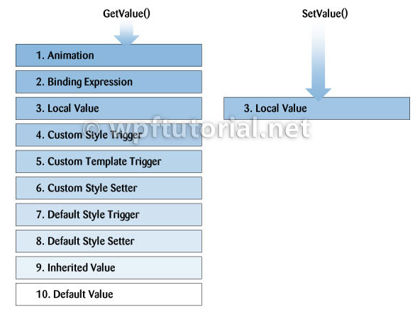
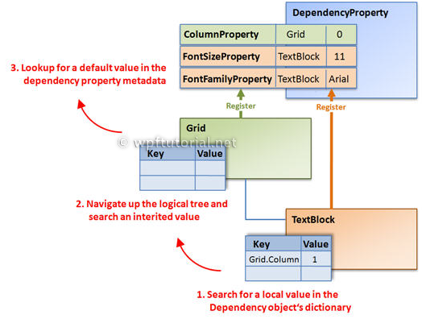

[TOC]


### 简介

原文: [WPF Tutorial | Dependency Properties](https://www.wpftutorial.net/DependencyProperties.html)

当你开始使用WPF开发应用程序时，很快就会发现依赖属性。它们看起来与普通的.NET属性非常相似，但背后的概念要复杂得多，功能也强大得多。

主要的区别是，普通.NET属性的值**直接**从类中的私有成员读取，而DependencyProperty的值在调用从DependencyObject继承的GetValue()方法时**动态解析**。

当你设置依赖属性的值时，它不会存储在对象的字段中，而是存储在基类DependencyObject提供的键和值字典中。**条目的键是属性的名称，值是要设置的值。**

依赖属性的优点是：

- 减少内存占用

  你想一下当UI控件的90%以上的属性通常保持在初始值时，为每个属性存储一个字段是一个巨大的消耗。依赖属性通过只在实例中存储修改过的属性来解决这些问题。默认值只在依赖项属性中存储一次。

- 值继承

  访问依赖项属性时，将使用值解析策略解析值。如果没有设置本地值，依赖项属性将沿着逻辑树向上导航，直到找到一个值。当你在根元素上设置FontSize时，它适用于下面所有的文本块，除非你重写了这个值。

- 更改通知

  依赖项属性具有内置的更改通知机制。通过在属性元数据中注册回调，当属性值发生更改时，你将得到通知。这也被数据绑定使用。

### 值解析策略

每次访问依赖属性时，它都会按照从高到低的优先级在内部解析该值。它检查一个本地值是否可用，如果没有，如果自定义样式触发器是活动的，…并继续，直到它找到一个值。最后，默认值总是可用的。




### 背后的魔法

每个WPF控件向静态的**DependencyProperty**类注册一组DependencyProperties。它们每个都包含一个键(每个类型必须是唯一的)和一个元数据(包含回调和默认值)。

所有想要使用DependencyProperties的类型都必须派生自DependencyObject。这个基类定义了一个键值字典，其中包含依赖属性的local values。条目的键是用dependency属性定义的键。

当你通过它的.NET属性包装器访问一个依赖属性时，它会在内部调用GetValue(DependencyProperty)来访问该值。此方法通过使用值解析策略来解析值，下面将详细解释该策略。如果本地值可用，则直接从字典中读取。如果没有设置值，则沿着逻辑树向上查找继承值。如果没有找到值，则采用属性元数据中定义的默认值。这个序列有点简化，但它显示了主要概念。



### 如何创建一个依赖属性

要创建DependencyProperty，向您的类型中添加一个DependencyProperty类型的静态字段，并调用DependencyProperty. Register()来创建一个依赖属性的实例。DependendyProperty的名称必须总是以…Property结尾。这是WPF中的命名约定。

要使它作为普通的.NET属性可访问，您需要添加一个属性包装器。这个包装器只在内部使用从DependencyObject继承的GetValue()和SetValue()方法获取和设置值，并将DependencyProperty作为键传递。

*重要提示:不要向这些属性添加任何逻辑，因为只有在从代码中设置属性时才会调用它们。如果从XAML中设置属性，则直接调用SetValue()方法。*

如果您正在使用Visual Studio，您可以输入propdp并点击2次Tab键来创建依赖项属性。

```c#
// Dependency Property
public static readonly DependencyProperty CurrentTimeProperty = 
     DependencyProperty.Register( "CurrentTime", typeof(DateTime),
     typeof(MyClockControl), new FrameworkPropertyMetadata(DateTime.Now));
 
// .NET Property wrapper
public DateTime CurrentTime
{
    get { return (DateTime)GetValue(CurrentTimeProperty); }
    set { SetValue(CurrentTimeProperty, value); }
}
```

每个DependencyProperty都提供了更改通知、值转换和验证的回调。这些回调在dependency属性上注册。

```c#
new FrameworkPropertyMetadata(DateTime.Now, 
                       OnCurrentTimePropertyChanged, 
                       OnCoerceCurrentTimeProperty ),
                       OnValidateCurrentTimeProperty );
```


#### 值更改回调

更改通知回调是一个静态方法，每次当TimeProperty的值发生变化时都会调用它。新值在EventArgs中传递，改变值的对象作为源传递。

```c#
private static void OnCurrentTimePropertyChanged(DependencyObject source, 
        DependencyPropertyChangedEventArgs e)
{
    MyClockControl control = source as MyClockControl;
    DateTime time = (DateTime)e.NewValue;
    // Put some update logic here...
}
```

#### 值转换回调

转换回调允许你在不抛出异常的情况下调整超出边界的值。一个很好的例子是进度条的值设置在最小值以下或最大值以上。在这种情况下，我们可以在允许的边界内转换值。在下面的例子中，我们将时间限制在过去。

```c#
private static object OnCoerceTimeProperty( DependencyObject sender, object data )
{
    if ((DateTime)data > DateTime.Now )
    {
        data = DateTime.Now;
    }
    return data;
}
```

#### 值验证回调

在validate回调中，检查设置的值是否有效。如果返回false，将抛出ArgumentException。在我们的示例需求中，数据是DateTime的一个实例。

```c#
private static bool OnValidateTimeProperty(object data)
{
    return data is DateTime;
}
```

### 只读的依赖属性

WPF控件的一些依赖属性是只读的。它们通常用于报告控件的状态，如IsMouseOver属性。为该值提供setter没有意义。

也许你会问自己，为什么不使用普通的.NET属性呢?一个重要的原因是不能在普通的.NET属性上设置触发器。

创建只读属性类似于创建常规的DependencyProperty。不是调用DependencyProperty.Register()而是调用DependencyProperty.RegisterReadonly()。这将返回一个**DependencyPropertyKey**。该键应该存储在类的私有或受保护的静态只读字段中。键使您可以在类中设置值，并像使用普通依赖项属性一样使用它。

第二件事是注册一个分配给DependencyPropertyKey.DependencyProperty的公共依赖属性。此属性是可从外部访问的只读属性。

```c#
// Register the private key to set the value
private static readonly DependencyPropertyKey IsMouseOverPropertyKey = 
      DependencyProperty.RegisterReadOnly("IsMouseOver", 
      typeof(bool), typeof(MyClass), 
      new FrameworkPropertyMetadata(false));
 
// Register the public property to get the value
public static readonly DependencyProperty IsMouseoverProperty = 
      IsMouseOverPropertyKey.DependencyProperty;    
 
// .NET Property wrapper
public int IsMouseOver
{
   get { return (bool)GetValue(IsMouseoverProperty); }
   private set { SetValue(IsMouseOverPropertyKey, value); }
}
```

### 附加属性

附加属性是一种特殊的DependencyProperties。它们允许您将一个值附加到一个不知道该值的对象上。

这一概念的一个很好的例子是布局面板。每个布局面板需要不同的数据来对齐它的子元素。Canvas需要顶部和左侧，DockPanel需要Dock等等。由于你可以编写自己的布局面板，列表是无限的。所以你看，不可能在所有WPF控件上拥有所有这些属性。

解决方案是附加属性。它们由需要特定上下文中来自另一个控件的数据的控件定义。例如，由父布局面板对齐的元素。

要设置附加属性的值，可以在XAML中添加一个属性，该属性的前缀为提供附加属性的元素。在Canvas面板中设置Canvas.Top和 Canvas.Left属性对齐的按钮，你可以这样写:

```c#
<Canvas>
    <Button Canvas.Top="20" Canvas.Left="20" Content="Click me!"/>
</Canvas>
```

```c#
public static readonly DependencyProperty TopProperty =
    //定义附加属性
    DependencyProperty.RegisterAttached("Top", 
    typeof(double), typeof(Canvas),
    new FrameworkPropertyMetadata(0d,
        FrameworkPropertyMetadataOptions.Inherits));
 
public static void SetTop(UIElement element, double value)
{
    element.SetValue(TopProperty, value);
}
 
public static double GetTop(UIElement element)
{
    return (double)element.GetValue(TopProperty);
}
```

### 监听依赖项属性的更改

如果你想侦听依赖项属性的更改，你可以子类化定义该属性的类型并覆盖属性元数据并传递PropertyChangedCallback。但更简单的方法是获取DependencyPropertyDescriptor并通过调用AddValueChanged()连接回调

```c#
DependencyPropertyDescriptor textDescr = DependencyPropertyDescriptor.
    FromProperty(TextBox.TextProperty, typeof(TextBox));
 
if (textDescr!= null)
{
    textDescr.AddValueChanged(myTextBox, delegate
    {
        // Add your propery changed logic here...
    });
} 
```

### 如何清除local value

因为null也是一个有效的本地值，所以存在常量 DependencyProperty.UnsetValue描述未设置值的Unset Value。

```c#
button1.ClearValue( Button.ContentProperty);
```


