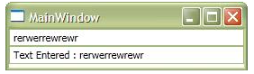

[TOC]

## 类型转换器和标记扩展

原文:[TypeConverter & Markup Extension](https://www.codeproject.com/Articles/140618/WPF-Tutorial-TypeConverter-Markup-Extension)

作为一种可扩展的标记语言，XAML具有很大的灵活性，可以在XAML本身中创建对象，并实现自动绑定、数据转换等功能。标记扩展允许您在一定程度上真正扩展您的标记，以提高您编写更少的代码和设计您的应用程序

### 简介

标记扩展是对XAML的扩展，您可以使用它在基于XAML的应用程序上分配自定义规则。因此，任何你想在你的设计器中强加给你的应用程序的自定义行为，你都应该使用标记扩展。在这里，我们将讨论如何使用标记扩展来生成XAML的自定义行为。

XAML或可扩展应用程序标记语言实际上是一种XML格式，它定义了特殊的模式。现在你可能总是想知道，Markup的可扩展性有多强。XAML和XML有哪些不同之处?是的，这是因为XAML解析器具有大量的功能，可以使普通的XML变成非常丰富的UI设计。

大家都知道XAML实际上是一种文本格式。这些标记与任何XML非常相似，其中属性将所有内容都作为String。即使你想将对象赋值给字符串，也不能这样做，因为对象只能接受字符串。Markup Extension允许您处理这类情况。因此，你可以说标记扩展实际上是将普通XML扩展为完整的可扩展标记作为XAML的方法。

由于XAML将所有内容都作为字符串，有时我们需要将这些数据转换为有效值。例如，当我们使用Margin时，我们需要指定每个Margin元素的值。**在这种转换非常简单和直接的情况下，我们可以使用类型转换器来完成这项工作，而不是使用标记扩展。**在转入标记扩展之前，让我们先讨论一下类型转换器。

### 类型转换器

正如我已经告诉你的，作为XML扩展的标记不能对数据元素施加限制。**这意味着我们只能为XAML中任何对象的属性指定字符串数据。但是XAML提供了创建Type转换器的灵活性，允许您对数据施加限制。**因此，当你在XAML中描述时，即使是像Single或Double这样基本的限制也不可以。类型转换器在将这一限制引入XAML解析器方面起着至关重要的作用。


XAML解析器在解析属性的任何值时需要两段信息。

1. 值类型(Value Type):这决定了字符串数据应该转换为的类型。
2. 实际值(Actual Value)

当解析器在属性中发现数据时，它首先查看类型。如果类型是基本类型，解析器将尝试直接转换。另一方面，如果它是Enumerable，则尝试将其转换为Enumerable的特定值。如果它们都不满足数据，则最后尝试找到合适的Type Converters类，并将其转换为合适的类型。XAML中已经定义了很多类型转换器，比如Margin。Margin = 10,20,0,30表示Margin:左，上，右，下按顺序定义。因此，系统定义了一个类型转换器，将该数据转换为Thickness对象。

#### 自定义类型转换器

要创建TypeConverter，我们需要

1. 创建一个类，用TypeConverterAttribute装饰该类，
2. 定义一个将数据转换为实际类型的自定义TypeConverter实现类。

让我们用一个例子来说明:

##### 类型转换器转换经纬度(GeoPoint):

如前所述，要创建TypeConverter，需要创建一个类，该类将为其应用TypeConverter。在我的例子中，我创建了一个类，它有两个属性叫做Latitude和Longitude，并创建了一个地理点(Geographic Point)的实现。让我们看看这个类是怎样的:

```c#
[global::System.ComponentModel.TypeConverter(typeof(GeoPointConverter))]
    public class GeoPointItem
    {
        public double Latitude { get; set; }
        public double Longitude { get; set; }

        public GeoPointItem()
        {
        }

        public GeoPointItem(double lat, double lon)
        {
            this.Latitude = lat;
            this.Longitude = lon;
        }

        public static GeoPointItem Parse(string data)
        {
            if (string.IsNullOrEmpty(data)) return new GeoPointItem();

            string[] items = data.Split(',');
            if (items.Count() != 2)
                throw new FormatException("GeoPoint should have both latitude 
                and longitude");

            double lat, lon;
            try
            {
                lat = Convert.ToDouble(items[0]);
            }
            catch (Exception ex) { 
                throw new FormatException("Latitude value cannot be converted", ex); 
            }

            try
            {
                lon = Convert.ToDouble(items[1]);
            }
            catch (Exception ex) { 
                throw new FormatException("Longitude value cannot be converted", ex); 
            }

            return new GeoPointItem(lat, lon);
        }

        public override string ToString()
        {
            return string.Format("{0},{1}", this.Latitude, this.Longitude);
        }
    }
```

在上面的代码中，您可以看到我创建了一个非常普通的类，它定义了地球上的一个地理点。该类型有两个参数，Latitude和Longitude，它们都是Double值。我还重写了ToString()方法，在这种情况下，该方法对于获取对象的字符串结果实际上非常重要。Parse方法用于将字符串格式解析为**GeoPointItem**。

实现此功能后，您需要做的第一件事是用TypeConverter Attribute装饰类。此属性确保使用作为参数传递给属性的TypeConverter GeoPointConverter轻松转换项目。因此，当XAML解析器解析字符串时，它将自动调用GeoPointConverter以适当地转换回值。

完成这些之后，我们需要创建实际的转换器:

```C#
public class GeoPointConverter : global::System.ComponentModel.TypeConverter
    {

        //should return true if sourcetype is string
        public override bool CanConvertFrom(
         System.ComponentModel.ITypeDescriptorContext context, Type sourceType)
        {
            if (sourceType is string)
                return true;
            return base.CanConvertFrom(context, sourceType);
        }
        //should return true when destinationtype if GeopointItem
        public override bool CanConvertTo(
             System.ComponentModel.ITypeDescriptorContext context, Type destinationType)
        {
            if (destinationType is string)
                return true;

            return base.CanConvertTo(context, destinationType);
        }
        //Actual convertion from string to GeoPointItem
        public override object ConvertFrom(
     System.ComponentModel.ITypeDescriptorContext context, 
         System.Globalization.CultureInfo culture, object value)
        {
            if (value is string)
            {
                try
                {
                    return GeoPointItem.Parse(value as string);
                }
                catch (Exception ex)
                {
                    throw new Exception(string.Format(
      "Cannot convert '{0}' ({1}) because {2}", value, value.GetType(), ex.Message), ex);
                }
            }

            return base.ConvertFrom(context, culture, value);
        }

        //Actual convertion from GeoPointItem to string
        public override object ConvertTo(
         System.ComponentModel.ITypeDescriptorContext context, 
          System.Globalization.CultureInfo culture, object value, Type destinationType)
        {
            if(destinationType == null)
                throw new ArgumentNullException("destinationType");
    
             GeoPointItem gpoint = value as GeoPointItem;

            if(gpoint != null)
            if (this.CanConvertTo(context, destinationType))
                return gpoint.ToString();
            
            return base.ConvertTo(context, culture, value, destinationType);
        }
    }
```

在上面的代码中，我们实现了从TypeConverter派生的转换器类。在从TypeConverter类实现它之后，我们需要重写XAML解析器调用的几个方法，并进行适当的修改，以便XAML解析器在需要时获得实际值。

- CanConvertFrom:当XAML解析器试图将字符串解析为GeopointItem值时，将调用该函数。当它返回true时，它调用ConvertFrom来进行实际的转换。
- CanConvertTo:当XAML解析器试图将GeoPointItem变量解析为等效的字符串时，将调用CanConvertTo。当它返回true时，它调用ConvertTo来进行实际的转换。
- ConvertFrom:进行实际转换，并在转换成功后返回GeoPointItem。
- ConvertTo:进行实际转换，并返回传入的GeoPointItem的等效字符串。

在上面的例子中，你可以看到我实际上已经使用TypeConverter类将字符串值转换为GeoPointItem，反之亦然。

现在是时候使用它了。为此，我建立了一个自定义的UserControl，并定义了一个地理点属性。XAML看起来非常简单:

```xaml
<Grid>
        <Grid.RowDefinitions>
            <RowDefinition/>
            <RowDefinition/>
        </Grid.RowDefinitions>
        <Grid.ColumnDefinitions>
            <ColumnDefinition/>
            <ColumnDefinition/>
        </Grid.ColumnDefinitions>
        <TextBlock Text="Latitude" Grid.Row="0" Grid.Column="0"></TextBlock>
        <TextBox x:Name="txtlat" MinWidth="40" Grid.Row="0" Grid.Column="1" 
              TextChanged="txtlat_TextChanged"/>
        <TextBlock Text="Longitude" Grid.Row="1" Grid.Column="0"></TextBlock>
        <TextBox x:Name="txtlon" MinWidth="40" Grid.Row="1" Grid.Column="1" 
             TextChanged="txtlon_TextChanged"/>
    </Grid>
```

它有2个文本框，分别显示纬度和经度的值。当这些文本框的值被修改时，GeopointItem的实际值也会被修改。

```c#
public partial class GeoPoint : UserControl
{
        public static readonly DependencyProperty GeoPointValueProperty = 
       DependencyProperty.Register("GeoPointValue", typeof(GeoPointItem), 
             typeof(GeoPoint), new PropertyMetadata(new GeoPointItem(0.0, 0.0)));
        public GeoPoint()
        {
            InitializeComponent();
        }
       
        public GeoPointItem GeoPointValue
        {
            get
            {
                return this.GetValue(GeoPointValueProperty) as GeoPointItem;
            }
            set
            {
                this.SetValue(GeoPointValueProperty, value);
            }
        }

        private void txtlat_TextChanged(object sender, TextChangedEventArgs e)
        {
            GeoPointItem item = this.GeoPointValue;

            item.Latitude = Convert.ToDouble(txtlat.Text);
            this.GeoPointValue = item;
        }

        private void txtlon_TextChanged(object sender, TextChangedEventArgs e)
        {
            GeoPointItem item = this.GeoPointValue;

            item.Longitude = Convert.ToDouble(txtlon.Text);
            this.GeoPointValue = item;
        }

        private void UserControl_Loaded(object sender, RoutedEventArgs e)
        {
            GeoPointItem item = this.GeoPointValue;
            this.txtlat.Text = item.Latitude.ToString();
            this.txtlon.Text = item.Longitude.ToString();

        }
    }
```

在这里，当UserControl加载时，它首先加载传递到文本框的值。TextChanged操作被处理，以确保无论何时文本框的值被修改，实际对象都被修改。

在窗口中，我们需要创建一个UserControl对象，并将值传递如下:

```xaml
<converter:GeoPoint x:Name="cGeoPoint" GeoPointValue="60.5,20.5" />
```

转换器指向命名空间。因此，你可以看到值正确显示在文本框。

#### 标记扩展

现在，你已经了解了TypeConverter，让我们考虑一下MarkupExtension。标记扩展提供了在XAML属性中创建自定义对象的灵活性。**每个标记扩展都包含在{}大括号中。**因此，在花括号内编写的任何内容都将被视为标记扩展。因此，XAML解析器不将花括号内的任何内容视为文字字符串，而是试图找到与花括号内指定的名称对应的实际MarkupExtension。

##### 特殊场景(Exception)

如果你想在字符串中放入大括号，你需要在开头放入{}，使其转换。您可以阅读[“如何在XAML中转义{}"](https://www.abhisheksur.com/2010/05/how-to-escape-in-xaml.html)了解更多信息。

```xaml
<textblock text="this is {my} name">
<!--out put "this is my name"-->
<textblock text="{}this is {my} name">   
<!--out put "this is {my} name"-->
```

标记扩展示例:

```xaml
<TextBox Text={x:Null} />
```

可能是最简单的，它实际上是一个MarkupExtension，它返回Null到文本字符串。


在System.Windows.Markup命名空间中已经有一些用XAML定义的标记扩展，这有助于每次在XAML中生成功能性特性。让我们来讨论其中的几个:

#### NullExtension

这是我们曾经使用的最简单的MarkupExtension。当对一个值放置时，它实际上返回Null。

```xaml
Content = "{x:Null}"
```

#### ArrayExtension

这是用来创建一个元素的数组列表。x:Array实际上返回指定类型Array的对象。

```xaml
Values = {x:Array Type=sys:String}
```

#### StaticExtension

另一个简单的扩展，返回静态字段或属性引用。

```xaml
Text="{x:Static Member=local:MyClass.StaticProperty}"
```

因此，当您为MyClass定义静态属性StaticProperty时，您将自动使用此属性将值设置到Text。

#### TypeExtension

类型扩展用于从对象中获取类型。当控件的属性接受Type对象时，可以使用它。

```xaml
TargetType="{x:Type Button}"
```

TargetType接收一个Button类型对象。

#### Reference

它用于引用在XAML中某处声明的对象的名称。它是由.NET 4.0引入的

```xaml
Text="{x:Reference Name=Myobject}"
```

#### ★StaticResourceExtension

资源是在XAML中定义的对象。StaticResource替换分配给对象的键，并替换其对声明的Resource元素的引用。

```xaml
<Grid.Resources>
<Color x:Key="rKeyBlack">Black</Color>
<SolidColorBrush Color="{StaticResource rKeyBlack}" x:Key="rKeyBlackBrush"/>
</Grid.Resources>
<TextBlock Background="{StaticResource ResourceKey=rKeyBlackBrush}" />
```

如果在编译时键不存在，StaticResource将输出错误。

#### ★DynamicResourceExtension

与StaticResource相同，但它将值延迟为运行时引用。因此，您可以为DynamicResource声明任何键，并且它应该在实际对象创建时在运行时出现。

```xaml
<TextBlock Background="{DynamicResource ResourceKey=rKeyBlackBrush}" />
```

现在rKeyBlackBrush如果没有在Grid. Resources声明不会出错。你可以在运行时窗口加载时添加它。

### 什么是资源(Resources)?

资源是由XAML解析器创建并呈现的对象。每个FrameworkElement对象中都有一个ResourceDictionary对象。您可以在这个ResourceDictionary中添加资源，并可以在范围内重用那些组件。

资源是可重复使用的组件，可以多次使用以产生其输出。因此，如果您需要一个希望在应用程序中多次重用的对象，并且不希望该对象在作用域内被更改，那么资源(Resources)是您的最佳选择。


```xaml
<Grid.Resources>
            <Color x:Key="rKeyRed">Red</Color>
            <Color x:Key="rKeyCyan">Cyan</Color>
            <LinearGradientBrush x:Key="rKeyforegroundGradient">
                <GradientStop Color="{StaticResource rKeyRed}" Offset="0"></GradientStop>
                <GradientStop Color="{StaticResource rKeyCyan}" Offset="1"></GradientStop>
            </LinearGradientBrush>
</Grid.Resources>

<TextBlock Text="{Binding ElementName=cGeoPoint, Path=GeoPointValue}" 
      FontSize="30" Margin="50" Grid.Row="1" Grid.ColumnSpan="2" 
      Foreground="{StaticResource rKeyforegroundGradient}" />
```

你可以看到，我们已经定义了一个LinearGradientBrush，并用作TextBlock的Foreground。该对象可以在任何需要的时候重用。

每个FrameworkElement都有一个名为Resource的属性，该属性接受一个ResourceDictionary对象。您可以将各种资源分配给此集合，这些资源将用于对象范围内创建的不同对象。**在XAML中，资源是使用x:Key属性声明的，之后这个键可以用来引用ResourceDictionary中的资源，使用StaticResource或DynamicResource。**

#### StaticResource和DynamicResource的区别

在应用程序加载期间，StaticResource在其作用域下的ResourceDictionary中找到定义的键。因此，如果在资源(Resource)中没有找到，编译器将在编译期间抛出错误。另一方面，DynamicResource Markup Extension将资源分配推迟到应用程序的实际运行时。因此，在创建对象之前，表达式保持不求值。

**注意:**如果资源是从Freezable(不可变immutable)派生的，对对象的任何更改都会改变UI，不管它是StaticResource还是DynamicResource。例如:画笔，动画，几何对象是Freezable的。

#### StaticResource和DynamicResource之间的选择

- StaticResource在运行时需要的CPU更少，因此速度更快。
- 在应用程序加载时创建StaticResource。因此，将所有内容都设置为StaticResource意味着减慢应用程序加载过程。
- 当编译期间资源未知时，您可以使用DynamicResource。当用户交互改变对象的外观时使用DynamicResource。
- 当您希望您的资源是可插入的时，DynamicResource是最好的。你可以阅读如何创建可插入资源:[Pluggable Styles and Resources in WPF with Language Converter Tool](https://www.codeproject.com/Articles/123457/Pluggable-Styles-and-Resources-in-WPF-with-Languag)

### 绑定(Binding)

绑定是最重要和最复杂的标记扩展，可以用来绑定一个对象。当数据对象被分配给该对象的DataContext时，它提供了Databound对象。

因此，假设你有一个对象Obj，它有几个属性，如名称，年龄等。然后你可能会写

```xaml
Text = "{Binding Name}"
```

这意味着DataContext对象将在运行时自动计算，对象的Name属性的实际值将显示在Text属性上。

绑定具有很多灵活性，因此可以在绑定对象上指定表达式，从而使其成为最复杂的Markup扩展之一。



```xaml
<StackPanel Orientation="Vertical">
        <TextBox x:Name="txtObj"></TextBox>
        <TextBox x:Name="txtCustom" Text="{Binding FallbackValue=10, 
        ElementName=txtObj, Path=Text,StringFormat='Text Entered : {0:N2}'}, Mode=TwoWay">
        </TextBox>
    </StackPanel>
```

由于两者都是绑定的，对属性的任何更改都会自动反映对另一个文本框的更改。这些绑定有几种模式:OneTime, OneWayToSource, OneWay和TwoWay。StringFormat创建字符串的格式。我们可以让转换器与绑定相关联，使我们能够根据所输入的值返回适当的值。

你可以阅读如何创建绑定转换器:[How to use IValueConverter in Binding of WPF](https://www.abhisheksur.com/2010/03/how-to-use-ivalueconverter-in-binding.html)

在绑定的情况下，你还必须确保被绑定的对象已经实现了**INotifyPropertyChanged**。否则，每个绑定都将作为OneTime工作。

你可以阅读更多关于如何实现绑定与INotifyPropertyChanged:[Object Notifiers using INotifyPropertyChanged, INotifyCollectionChanged](https://www.abhisheksur.com/2010/05/object-notifiers-using.html)

我们将在下一篇文章中更详细地讨论绑定

### 相对资源(RelativeSource)

RelativeSource是一个MarkupExtension，你必须在Binding中使用。绑定有一个名为RelativeSource的属性，您可以在其中指定一个RelativeSource MarkupExtension。这个标记扩展允许您对元素提供相对引用，而不是绝对指定值。当绝对引用不可用时，RelativeSource会派上用场。

RelativeSource有几个可以使用的属性:

1. **祖宗类型(AncestorType)**:它定义了要找到的属性所在的祖宗元素的类型。如果你在一个网格Grid中定义了一个按钮，并且你想要引用那个网格Grid，你可以使用RelativeSource。
2. **模式(Mode)** :决定如何找到RelativeSource。枚举值很少:
   - **Self**:这意味着绑定将在对象本身中发生。所以如果你想要Background和Foreground 使用同一个对象，RelativeSource Mode = Self就会派上用场。
   - **FindAncestor**:查找其父元素。因此，它将遍历visual树中的所有可视元素，并试图找到提供了祖宗类型的控件，并继续下去，直到在它的祖宗元素中找到对象。
   - **TemplatedParent**: TemplatedParent允许你从定义模板的对象中找到值。模板是控件本身的定义，有助于重新定义数据和控件元素。TemplatedParent允许你直接找到Templated对象。
   - **PreviousData**:当对象绑定到CollectionView时，这允许您跟踪PreviousData元素。因此，这实际上是之前数据元素的相对资源。
3. **祖先层级(AncestorLevel)** :一个数值，它决定了RelativeSource在确定结果之前应该搜索多少个层级。如果指定1为AncestorLevel，它将只经过一个层级。

您可以对任何绑定使用RelativeSource。

```xaml
<Grid Name="grd"> 
       <TextBox x:Name="txtCustom" Text="{Binding Name,
RelativeSource={RelativeSource AncestorType={x:Type Grid},
Mode=FindAncestor,AncestorLevel=2}}" />
</Grid>
```

这允许您找到Grid。实际上，这个例子并没有告诉你什么时候使用RelativeSource，因为在这种情况下，你可以很容易地获得对Grid的实际引用。当Grid有时不可访问时，RelativeSource非常有用，比如TextBox在Grid的DataTemplate中。

### 模板绑定(TemplateBinding)

TemplateBinding允许您将控件模板内对象的属性值绑定到对象TemplatedParent。

```xaml
<RadioButton Foreground="Red">
   <RadioButton.Template>
      <ControlTemplate>
        <ToggleButton Content="{TemplateBinding Foreground}" />
      </ControlTemplate>
   </RadioButton.Template>
</RadioButton>
```

在这种情况下，ToggleButton的标题将显示为#FFFF0000，这是RadioButton的等效颜色。

### 多个绑定(MultiBinding)

MultiBinding允许您基于多个绑定创建绑定。您可以从**IMultiValueConverter**创建一个类，它将允许您将多个binding语句转换为单个输出。**普通转换器和MultiValueConverter之间的唯一区别是普通的IValueConverter接受一个值作为参数，而MultiValueConverter接受来自所有绑定元素的值的数组。**我们将在本系列后面讨论更多有关MultiBinding的内容。

```xaml
<Button x:Name="NextImageButton" >
    <Button.IsEnabled>
        <MultiBinding Converter="{StaticResource SelectedItemIndexIsNotLastToBoolean}">
            <Binding Mode="OneWay" ElementName="ImageListBox" Path="SelectedIndex" />
            <Binding Mode="OneWay" ElementName="ImageListBox" Path="Items.Count" />
        </MultiBinding>
    </Button.IsEnabled>
    <Image Source="Icons/navigate_right.png"/>
</Button>
```

### 自定义标记扩展

在最后一节中，我将构建自定义标记扩展并使用它。为了简单起见，我们使用反射来获取字段、方法和属性，并将它们绑定到一个ListBox中。要创建自定义标记扩展，您需要创建一个类并从MarkupExtension继承它。该类有一个名为**ProvideValue**的抽象方法，您需要重写该方法以使MarkupExtension工作。所以**实际上XAML解析器调用这个ProvideValue从MarkupExtension获取输出。**所以实际的实现是这样的:

```xaml
public class ReflectionExtension : global::System.Windows.Markup.MarkupExtension
    {
        public Type CurrentType { get; set; }
        public bool IncludeMethods { get; set; }
        public bool IncludeFields { get; set; }
        public bool IncludeEvents { get; set; }

        public ReflectionExtension(Type currentType)
        {
            this.CurrentType = currentType;
        }
        
        public override object ProvideValue(IServiceProvider serviceProvider)
        {
            if (this.CurrentType == null)
                throw new ArgumentException("Type argument is not specified");

            ObservableCollection<string> collection = new ObservableCollection<string>();
            foreach(PropertyInfo p in this.CurrentType.GetProperties())
                collection.Add(string.Format("Property : {0}", p.Name));
 
            if(this.IncludeMethods)
                foreach(MethodInfo m in this.CurrentType.GetMethods())
                    collection.Add(string.Format("Method : {0} with {1} 
                      argument(s)", m.Name, m.GetParameters().Count()));
            if(this.IncludeFields)
                foreach(FieldInfo f in this.CurrentType.GetFields())
                    collection.Add(string.Format("Field : {0}", f.Name));
            if(this.IncludeEvents)
                foreach(EventInfo e in this.CurrentType.GetEvents())
                    collection.Add(string.Format("Events : {0}", e.Name));

            return collection;
        }

    }
```


可以看到该类的构造函数接受一个Type参数。现在要使用它，我们在XAML中引用它，并以类似于我们使用其他MarkupExtensions的方式使用它。

```xaml
<ListBox ItemsSource="{local:Reflection {x:Type Grid}, 
       IncludeMethods=true, IncludeFields=true, IncludeEvents=true}" 
         MaxHeight="200" Grid.Row="3" Grid.ColumnSpan="2" />
```

这里构造函数从{x:Type Grid}获取参数。**任何MarkupExtension的第一个参数都被视为构造函数参数。其他属性使用逗号分隔的字符串定义。**

### 结论

本文讨论基本XAML应用程序的标记扩展和类型转换器的基础知识。我们已经把Binding标记扩展放在后面，我们将在下一个主题中讨论它。我希望这篇文章对你们所有人都有帮助。感谢阅读。
