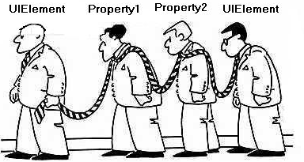

[TOC]

# Concept Binding

原文:[WPF Tutorial - Concept Binding](https://www.codeproject.com/Articles/140621/WPF-Tutorial-Concept-Binding)

绑定是WPF编程中最重要的主题。在本文中，将演示如何使用数据绑定来确保表示逻辑与视图分离，还简单演示了数据绑定(DataBinding)概念如何工作。

### 简介

今天我将讨论我们所说的任何WPF应用程序中最重要的部分——绑定。WPF提供了高级的数据绑定功能，允许用户绑定对象，这样当其他对象发生变化时，主对象就会反映它的变化。DataBinding的主要目的是确保UI始终自动地与内部对象结构同步。



数据绑定在WPF引入之前就已经存在了。在ASP.NET中，我们绑定数据元素以呈现控件中的适当数据。我们通常传入一个DataTable并绑定模板以从各个DataRows获取数据。另一方面，对于传统的windows窗体应用程序，我们也可以将属性绑定到数据元素。可以将绑定添加到对象的属性中，以确保每当属性更改值时，数据都会在内部反映到数据中。因此，一言以蔽之，数据绑定对于系统来说并不是什么新鲜事。**DataBinding的主要目标是向应用程序显示数据，从而减少应用程序开发人员为使应用程序正确显示数据而编写的工作量。**在本文中，我将讨论如何在WPF应用程序中使用数据绑定，并创建一个示例应用程序来深入演示该特性。

### WPF中的绑定

WPF进一步扩展了绑定的概念，并引入了新的特性，因此我们可以广泛地使用绑定特性。绑定建立应用程序和业务层之间的连接。如果您希望应用程序遵循严格的设计模式规则，数据绑定概念将帮助您实现这一目标。我们将在稍后详细讨论如何做到这一点。

在WPF中，我们可以绑定两个属性，一个Property和一个DependencyProperty，两个DependencyProperties等等。WPF还支持命令(**Command**)绑定。让我们详细讨论如何实现它们。

绑定可以分为几种类型：

#### 数据绑定/对象绑定

最重要和最主要的绑定是数据绑定。WPF将ObjectDataProvider和XMLDataProvider等对象声明到XAML中，以增强对象绑定的能力。数据绑定可以通过几种方式实现。我们可以通过使用XAML、XAML和C#以及C#本身来利用绑定功能。所以WPF足够灵活，可以处理任何情况。

```xaml
<TextBox x:Name="txtName" />
<TextBlock Text="{Binding ElementName=txtName, Path=Text.Length}" />
```

在上述情况中，我已经展示了Binding的最基本用法。TextBlock的文本属性与TextBox txtName绑定，以便每当您在运行期间在TextBox上输入一些内容时，TextBlock将显示字符串的长度。

**由于标记扩展绑定实际上是一个具有属性的类**，这里我们指定了属性ElementName和Path的值。**ElementName确保属性所属的对象。Path确定对象需要查看的属性路径。**

你可以使用**ObjectDataProvider**轻松地处理XAML中的数据。ObjectDataProvider可以作为资源添加，以后可以使用StaticResource引用。让我们看看下面的代码:

```xaml
<StackPanel Orientation="Vertical">
    <StackPanel.Resources>
      <ObjectDataProvider ObjectType="{x:Type m:StringData}"
         x:Key="objStrings" MethodName="GetStrings"/>
	</StackPanel.Resources>
    <ListBox Name="lstStrings" Width="200" Height="300"
           ItemsSource="{Binding Source={StaticResource objStrings}}" />
```

如上所示，ObjectType将获得一个Type，这是将调用GetStrings方法的内部类结构。ListBox，我引用了对象使用StaticResource。现在在代码中，你可以声明一个类:

```C#
public class StringData
 {
  		ObservableCollection<String> lst= new ObservableCollection<String>();
        public StringData()
        {
            lst.Add("Abhishek");
            lst.Add("Abhijit");
            lst.Add("Kunal");
            lst.Add("Sheo");
        }
        public ObservableCollection<String> GetStrings()
        {
             return lst;
        }
    }
```

你可以看到列表已经被字符串填充了。

##### ObservableCollection、INotifyPropertyChanged、INotifyCollectionChanged?


#### XML绑定

### DataContext的重要性

### 绑定的成员

### 隐藏代码中的绑定

### 命令绑定

### 多次绑定

### 总结