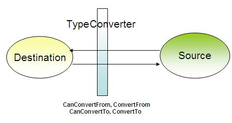

[TOC]

## 类型转换器和标记扩展

原文:[TypeConverter & Markup Extension](https://www.codeproject.com/Articles/140618/WPF-Tutorial-TypeConverter-Markup-Extension)

作为一种可扩展的标记语言，XAML具有很大的灵活性，可以在XAML本身中创建对象，并实现自动绑定、数据转换等功能。标记扩展允许您在一定程度上真正扩展您的标记，以提高您编写更少的代码和设计您的应用程序

### 简介

标记扩展是对XAML的扩展，您可以使用它在基于XAML的应用程序上分配自定义规则。因此，任何你想在你的设计器中强加给你的应用程序的自定义行为，你都应该使用标记扩展。在这里，我们将讨论如何使用标记扩展来生成XAML的自定义行为。

XAML或可扩展应用程序标记语言实际上是一种XML格式，它定义了特殊的模式。现在你可能总是想知道，Markup的可扩展性有多强。XAML和XML有哪些不同之处?是的，这是因为XAML解析器具有大量的功能，可以使普通的XML变成非常丰富的UI设计。

大家都知道XAML实际上是一种文本格式。这些标记与任何XML非常相似，其中属性将所有内容都作为String。即使你想将对象赋值给字符串，也不能这样做，因为对象只能接受字符串。Markup Extension允许您处理这类情况。因此，你可以说标记扩展实际上是将普通XML扩展为完整的可扩展标记作为XAML的方法。

由于XAML将所有内容都作为字符串，有时我们需要将这些数据转换为有效值。例如，当我们使用Margin时，我们需要指定每个Margin元素的值。**在这种转换非常简单和直接的情况下，我们可以使用类型转换器来完成这项工作，而不是使用标记扩展。**在转入标记扩展之前，让我们先讨论一下类型转换器。

### 类型转换器

正如我已经告诉你的，作为XML扩展的标记不能对数据元素施加限制。**这意味着我们只能为XAML中任何对象的属性指定字符串数据。但是XAML提供了创建Type转换器的灵活性，允许您对数据施加限制。**因此，当你在XAML中描述时，即使是像Single或Double这样基本的限制也不可以。类型转换器在将这一限制引入XAML解析器方面起着至关重要的作用。



XAML解析器在解析属性的任何值时需要两段信息。

1. 值类型(Value Type):这决定了字符串数据应该转换为的类型。
2. 实际值(Actual Value)

当解析器在属性中发现数据时，它首先查看类型。如果类型是基本类型，解析器将尝试直接转换。另一方面，如果它是Enumerable，则尝试将其转换为Enumerable的特定值。如果它们都不满足数据，则最后尝试找到合适的Type Converters类，并将其转换为合适的类型。XAML中已经定义了很多类型转换器，比如Margin。Margin = 10,20,0,30表示Margin:左，上，右，下按顺序定义。因此，系统定义了一个类型转换器，将该数据转换为Thickness对象。

#### 自定义类型转换器

要创建TypeConverter，我们需要

1. 创建一个类，用TypeConverterAttribute装饰该类，
2. 定义一个将数据转换为实际类型的自定义TypeConverter实现类。

让我们用一个例子来说明:

##### 类型转换器转换经纬度(GeoPoint):

如前所述，要创建TypeConverter，需要创建一个类，该类将为其应用TypeConverter。在我的例子中，我创建了一个类，它有两个属性叫做Latitude和Longitude，并创建了一个地理点(Geographic Point)的实现。让我们看看这个类是怎样的:

```c#
[global::System.ComponentModel.TypeConverter(typeof(GeoPointConverter))]
    public class GeoPointItem
    {
        public double Latitude { get; set; }
        public double Longitude { get; set; }

        public GeoPointItem()
        {
        }

        public GeoPointItem(double lat, double lon)
        {
            this.Latitude = lat;
            this.Longitude = lon;
        }

        public static GeoPointItem Parse(string data)
        {
            if (string.IsNullOrEmpty(data)) return new GeoPointItem();

            string[] items = data.Split(',');
            if (items.Count() != 2)
                throw new FormatException("GeoPoint should have both latitude 
                and longitude");

            double lat, lon;
            try
            {
                lat = Convert.ToDouble(items[0]);
            }
            catch (Exception ex) { 
                throw new FormatException("Latitude value cannot be converted", ex); 
            }

            try
            {
                lon = Convert.ToDouble(items[1]);
            }
            catch (Exception ex) { 
                throw new FormatException("Longitude value cannot be converted", ex); 
            }

            return new GeoPointItem(lat, lon);
        }

        public override string ToString()
        {
            return string.Format("{0},{1}", this.Latitude, this.Longitude);
        }
    }
```

在上面的代码中，您可以看到我创建了一个非常普通的类，它定义了地球上的一个地理点。该类型有两个参数，Latitude和Longitude，它们都是Double值。我还重写了ToString()方法，在这种情况下，该方法对于获取对象的字符串结果实际上非常重要。Parse方法用于将字符串格式解析为**GeoPointItem**。

实现此功能后，您需要做的第一件事是用TypeConverter Attribute装饰类。此属性确保使用作为参数传递给属性的TypeConverter GeoPointConverter轻松转换项目。因此，当XAML解析器解析字符串时，它将自动调用GeoPointConverter以适当地转换回值。

完成这些之后，我们需要创建实际的转换器:

```C#
public class GeoPointConverter : global::System.ComponentModel.TypeConverter
    {

        //should return true if sourcetype is string
        public override bool CanConvertFrom(
         System.ComponentModel.ITypeDescriptorContext context, Type sourceType)
        {
            if (sourceType is string)
                return true;
            return base.CanConvertFrom(context, sourceType);
        }
        //should return true when destinationtype if GeopointItem
        public override bool CanConvertTo(
             System.ComponentModel.ITypeDescriptorContext context, Type destinationType)
        {
            if (destinationType is string)
                return true;

            return base.CanConvertTo(context, destinationType);
        }
        //Actual convertion from string to GeoPointItem
        public override object ConvertFrom(
     System.ComponentModel.ITypeDescriptorContext context, 
         System.Globalization.CultureInfo culture, object value)
        {
            if (value is string)
            {
                try
                {
                    return GeoPointItem.Parse(value as string);
                }
                catch (Exception ex)
                {
                    throw new Exception(string.Format(
      "Cannot convert '{0}' ({1}) because {2}", value, value.GetType(), ex.Message), ex);
                }
            }

            return base.ConvertFrom(context, culture, value);
        }

        //Actual convertion from GeoPointItem to string
        public override object ConvertTo(
         System.ComponentModel.ITypeDescriptorContext context, 
          System.Globalization.CultureInfo culture, object value, Type destinationType)
        {
            if(destinationType == null)
                throw new ArgumentNullException("destinationType");
    
             GeoPointItem gpoint = value as GeoPointItem;

            if(gpoint != null)
            if (this.CanConvertTo(context, destinationType))
                return gpoint.ToString();
            
            return base.ConvertTo(context, culture, value, destinationType);
        }
    }
```

在上面的代码中，我们实现了从TypeConverter派生的转换器类。在从TypeConverter类实现它之后，我们需要重写XAML解析器调用的几个方法，并进行适当的修改，以便XAML解析器在需要时获得实际值。

- CanConvertFrom:当XAML解析器试图将字符串解析为GeopointItem值时，将调用该函数。当它返回true时，它调用ConvertFrom来进行实际的转换。
- CanConvertTo:当XAML解析器试图将GeoPointItem变量解析为等效的字符串时，将调用CanConvertTo。当它返回true时，它调用ConvertTo来进行实际的转换。
- ConvertFrom:进行实际转换，并在转换成功后返回GeoPointItem。
- ConvertTo:进行实际转换，并返回传入的GeoPointItem的等效字符串。

在上面的例子中，你可以看到我实际上已经使用TypeConverter类将字符串值转换为GeoPointItem，反之亦然。

现在是时候使用它了。为此，我建立了一个自定义的UserControl，并定义了一个地理点属性。XAML看起来非常简单:

```xaml
<Grid>
        <Grid.RowDefinitions>
            <RowDefinition/>
            <RowDefinition/>
        </Grid.RowDefinitions>
        <Grid.ColumnDefinitions>
            <ColumnDefinition/>
            <ColumnDefinition/>
        </Grid.ColumnDefinitions>
        <TextBlock Text="Latitude" Grid.Row="0" Grid.Column="0"></TextBlock>
        <TextBox x:Name="txtlat" MinWidth="40" Grid.Row="0" Grid.Column="1" 
              TextChanged="txtlat_TextChanged"/>
        <TextBlock Text="Longitude" Grid.Row="1" Grid.Column="0"></TextBlock>
        <TextBox x:Name="txtlon" MinWidth="40" Grid.Row="1" Grid.Column="1" 
             TextChanged="txtlon_TextChanged"/>
    </Grid>
```

它有2个文本框，分别显示纬度和经度的值。当这些文本框的值被修改时，GeopointItem的实际值也会被修改。

```c#
public partial class GeoPoint : UserControl
{
        public static readonly DependencyProperty GeoPointValueProperty = 
       DependencyProperty.Register("GeoPointValue", typeof(GeoPointItem), 
             typeof(GeoPoint), new PropertyMetadata(new GeoPointItem(0.0, 0.0)));
        public GeoPoint()
        {
            InitializeComponent();
        }
       
        public GeoPointItem GeoPointValue
        {
            get
            {
                return this.GetValue(GeoPointValueProperty) as GeoPointItem;
            }
            set
            {
                this.SetValue(GeoPointValueProperty, value);
            }
        }

        private void txtlat_TextChanged(object sender, TextChangedEventArgs e)
        {
            GeoPointItem item = this.GeoPointValue;

            item.Latitude = Convert.ToDouble(txtlat.Text);
            this.GeoPointValue = item;
        }

        private void txtlon_TextChanged(object sender, TextChangedEventArgs e)
        {
            GeoPointItem item = this.GeoPointValue;

            item.Longitude = Convert.ToDouble(txtlon.Text);
            this.GeoPointValue = item;
        }

        private void UserControl_Loaded(object sender, RoutedEventArgs e)
        {
            GeoPointItem item = this.GeoPointValue;
            this.txtlat.Text = item.Latitude.ToString();
            this.txtlon.Text = item.Longitude.ToString();

        }
    }
```

在这里，当UserControl加载时，它首先加载传递到文本框的值。TextChanged操作被处理，以确保无论何时文本框的值被修改，实际对象都被修改。

在窗口中，我们需要创建一个UserControl对象，并将值传递如下:

```xaml
<converter:GeoPoint x:Name="cGeoPoint" GeoPointValue="60.5,20.5" />
```

转换器指向命名空间。因此，你可以看到值正确显示在文本框。

#### 标记扩展


##### 异常

#### NullExtension

#### ArrayExtension

#### StaticExtension

#### TypeExtension

#### 参考

#### StaticResourceExtension

#### DynamicResourceExtension

### 什么是资源?

### StaticResource和DynamicResource之间的选择

### 绑定

### RelativeSource

### TemplateBinding

### MultiBinding

### 自定义标记扩展

### 结论
