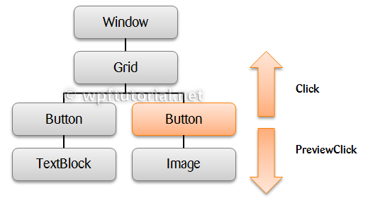

### 路由事件

原文：[WPF Tutorial | Routed Events](https://www.wpftutorial.net/RoutedEvents.html)



路由事件是根据其RoutingStrategy在可视树中向上或向下导航的事件。路由策略可以是冒泡路由(bubble)、隧道路由(tunnel)和直接路由(direct)。通过使用附加的事件语法，你可以在引发事件的元素上连接事件处理程序，也可以在事件之上或之下的其他元素上连接事件处理程序:Button.Click="Button_Click"。

路由事件通常成对出现。第一个是称为PreviewMouseDown的隧道事件，第二个是称为MouseDown的冒泡事件。到达事件处理程序后它们不会停止路由。要停止路由，你必须设置e.Handled = true;

- **Tunneling** 事件在根元素上引发，并向下导航到可视树，直到它到达源元素，或者通过将事件标记为handeld而停止向下导航。根据命名惯例，它被称为**Preview…**并出现在相应的冒泡事件之前。
- **Bubbling** 事件在源元素上引发，并向上导航到可视树，直到到达根元素，或者通过将事件标记为已处理(handeld)而停止冒泡。冒泡事件在隧道事件之后引发。
- **Direct** 该事件是在源元素上引发的，必须在源元素本身上处理。此行为与普通的. NET事件相同。

### 如何创建自定义路由事件

```c#
// Register the routed event
public static readonly RoutedEvent SelectedEvent = 
    EventManager.RegisterRoutedEvent( "Selected", RoutingStrategy.Bubble, 
    typeof(RoutedEventHandler), typeof(MyCustomControl));
 
// .NET wrapper
public event RoutedEventHandler Selected
{
    add { AddHandler(SelectedEvent, value); } 
    remove { RemoveHandler(SelectedEvent, value); }
}
 
// Raise the routed event "selected"
RaiseEvent(new RoutedEventArgs(MyCustomControl.SelectedEvent));
```

