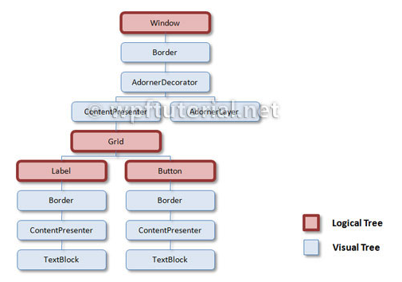

[TOC]

### 逻辑与可视化树



### 简介

WPF用户界面的元素在层次上是相关的。这个关系被称为LogicalTree。一个元素的模板由多个可视化元素组成。这个树被称为VisualTree。WPF在这两种树之间有所不同，因为对于某些问题，您只需要逻辑元素，而对于其他问题，您需要所有元素。

```xaml
<Window>
    <Grid>
        <Label Content="Label" />
        <Button Content="Button" />
    </Grid>
</Window>
```

### 为什么我们需要两种不同的树?

WPF控件由多个更基本的控件组成。例如，按钮由边框、矩形和内容显示器组成。这些控件是按钮的视觉子控件。
当WPF呈现按钮时，元素本身没有外观，但它遍历可视化树并呈现它的可视化子元素。这种层次关系也可以用于进行命中测试、布局等。
但是有时候你对控件模板的边框和矩形不感兴趣。特别因为模板是可以替换的，所以不应该涉及到可视化的树形结构!正因为如此，你需要一个更健壮的树，它只包含“真正的”控件——而不是模板的所有部分。这就是逻辑树的条件。

#### 逻辑树

逻辑树描述了用户界面元素之间的关系。逻辑树负责:

- 继承DependencyProperty值
- 解析DynamicResources引用
- 查找绑定的元素名称
- 传递RoutedEvents

#### 可视化树

可视化树包含所有逻辑元素，包括每个元素模板的所有可视化元素。可视化树负责:

- 渲染视觉元素
- 传递元素透明度
- 传递布局和渲染变换
- 传递IsEnabled属性。
- 做碰撞测试
- 相对来源RelativeSource (寻找祖先FindAncestor)

#### 在可视化树中以编程方式查找祖先

如果你是一个用户界面的子元素，你想要访问父元素的数据，但是你不知道这些元素的嵌套层次，那么最好的解决方案就是沿着树向上导航，直到找到一个请求类型的元素。

这个helper类正是这样做的。您可以使用几乎相同的代码来导航逻辑树。

```c#
public static class VisualTreeHelperExtensions
{
    public static T FindAncestor<T>(DependencyObject dependencyObject)
        where T : class
    {
        DependencyObject target = dependencyObject;
        do
        {
            target = VisualTreeHelper.GetParent(target);
        }
        while (target != null && !(target is T));
        return target as T;
    }
}
```

下面的示例展示了如何使用helper。它从this对象开始，沿着可视化树向上导航，直到找到Grid类型的元素。如果helper到达树的根元素，它将返回null。

```C#
var grid = VisualTreeHelperExtensions.FindAncestor<Grid>(this);
```


