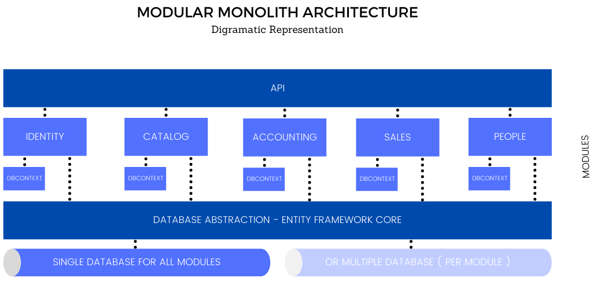
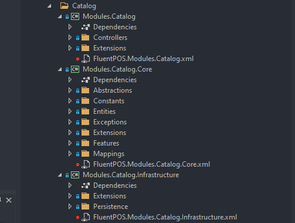
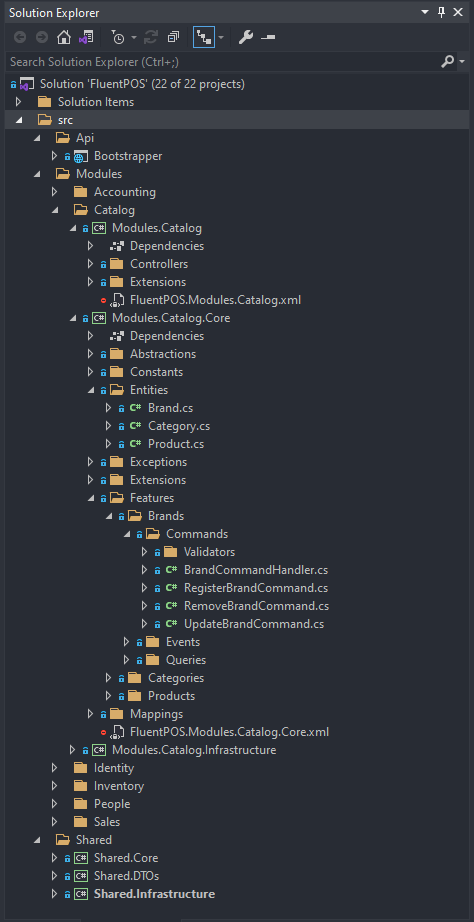
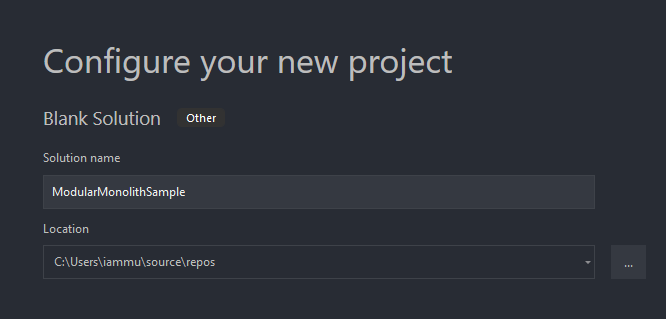
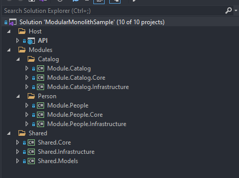
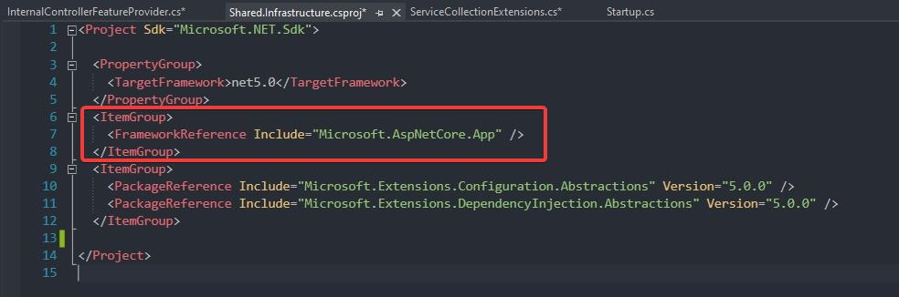
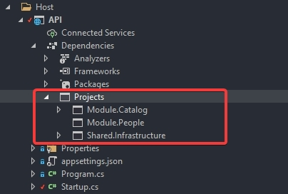
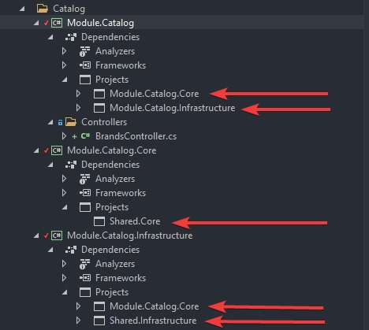

[TOC]

原文:[Modular Architecture in ASP.NET Core - Building Better Monoliths](https://codewithmukesh.com/blog/modular-architecture-in-aspnet-core/)

## ASP.NET Core的模块化架构

在本文中，我们将讨论在ASP.NET Core中使用模块化体系结构构建模块化Web应用程序。我们将讨论单体式应用的各种优缺点，并研究如何以更好的方式构建单体应用程序。让我们称它为模块化单体体系结构。在稍后的章节中，我们将构建一个遵循模块化架构的示例解决方案。让我们开始吧。

您可以在[这里](https://github.com/iammukeshm/modular-monolith-aspnet-core-sample)找到这个实现的完整源代码。

### 背景

在POS和库存管理系统方面有相当丰富的经验，我们开始使用我们最喜欢的技术堆栈和工具构建一个成熟的开源系统。当我们开始时，模块化开发是我们的主要需求。适应微服务架构是我们的第一选择。但是考虑到微服务架构体系结构的复杂性，我们决定至少在一开始不使用它。我们将产品命名为Fluentpos。

实际上没有实现微服务的真正需要。Fluentpos旨在帮助企业进行日常活动。为此，一个设计良好的单体应用程序也可以做到这一点。我们明确了将API和UI分开，以便在未来有机会为多个客户端应用提供服务。

WebAPI应用程序必须高度模块化，以改善开发体验。这需要将应用程序模块逻辑分解，如身份、目录、销售、库存。每个模块都有自己的controllers/interfaces/dbContext。至于数据库提供商，将使用Postgres/MSSQL。一个模块不能直接与另一个模块通信，也不能修改它的表。横切关注点将使用interfaces/events。是的，领域事件也包括在使用mediator Handler的项目中。每个模块都遵循干净体系架构设计/洋葱结构/Hex。

从本质上讲，我们最终会得到一个包含多个模块的解决方案，其中每个模块都实现了Clean/Onion架构的变体。

这就是我开始写关于这种架构的文章的原因。

### 单体架构

现有的80%的应用程序可能都使用了Monolith Architecture。您很有可能已经在您正在进行的项目中使用它。这是一种非常直接的应用程序架构方法，其中只有一个应用程序入口点。这意味着单个部署通常就足以将产品投入生产。将应用程序想象成一个单独的代码块，在内部划分为多个关注点(Business、Data Access、Infrastructure)。

下面是一个简单的整体体系结构的说明：


你可以称之为3层架构或N层架构，都是一样的。最终这是一个整体。它是一个单独的应用程序代码块，不依赖于其他应用程序(exes)。

### 暂时避免微服务的原因

[微服务](https://codewithmukesh.com/blog/microservice-architecture-in-aspnet-core/)绝对是你能为大规模应用程序实现的最佳架构。但我们现在看到的趋势是，即使是中等规模的应用程序也倾向于使用它。这真的是必需的吗?大多数时候，答案是否定的。

阅读微服务架构内容：[Microservice Architecture in ASP.NET Core with API Gateway here](https://codewithmukesh.com/blog/microservice-architecture-in-aspnet-core/).

尽管它是一个可伸缩的体系结构，但它也有很多缺点。实际上，没有不存在缺点的理想解决方案。这完全取决于需求以及您对实现的满意程度。Message buses消息总线、Consumers消费者、Publishers发布者、Multiple deployments多重部署，这些都是微服务带来的一些复杂性。

### 需要建造更好的单体架构

过渡到微服务是一个非常痛苦的过程，因为你要在实践层面上教育整个团队所有必要的基础知识。对于大多数产品和代码库来说，坚持构建良好的整体架构是可行的解决方案。当你的产品的用户基数激增时，你就需要转向微服务方法了。但在此之前，在设计你的应用程序时，既要模仿微服务，又要保持Monoliths的简单和优点。有道理，对吧?

### 什么是模块化单体架构?

模块化单体体系结构是一种软件设计，在这种体系结构中，单体被做得更好，并且模块化，重要的是重用组件/模块。从整体架构过渡到模块化整体架构通常是相当容易的。

这里有一个例子:



这里的主要思想是构建一个更好的Monolith解决方案。

- API/Host——一个非常薄的Rest API/主机应用程序，负责将其他模块的controllers/services注册到服务容器中。
- Modules——业务单元的逻辑块。例如，销售。所有与销售相关的信息都可以在这里找到。我们将在下一节中详细介绍模块的定义。
- Shared Infrastructure——在这里可以找到特定于应用程序的接口和实现，供其他模块使用。包括中间件、数据访问提供者等等。
- 最后是数据库。注意，您可以灵活地使用多个数据库，即每个模块一个数据库。但这最终取决于您希望如何设计应用程序。

可以看到它与标准Monolith实现并没有太大的偏差。基本方法是将应用程序拆分为多个较小的应用程序/模块，并使它们遵循干净的体系结构原则。

### 模块的定义

- 模块是业务需求的逻辑单元。在Sales应用程序中，销售、客户和库存是模块的几个例子。
- 每个模块都有一个DBContext，并且只能访问指定的表/实体。
- 一个模块不应该依赖于任何其他模块。它可以依赖于共享应用程序项目中出现的抽象接口。
- 每个模块都必须遵循领域驱动的体系结构
- 每个模块将进一步划分为API、Core和Infrastructure，以实现[清洁架构](https://codewithmukesh.com/blog/onion-architecture-in-aspnet-core/)。
- 跨模块通信只能通过接口/事件/内存总线进行。跨模块DB写应该保持最小或完全避免。

为了更好地理解，让我们看看fluentpos项目中的一个实际模块，并检查它的职责。




- Modules.Catalog——包含模块所需的API控制器。
- Modules.Catalog.Core——包含Entities, Abstractions, CQRS处理程序以及模块独立运行所需的所有内容。
- Modules.Catalog.Infrastructure -由DbContexts和Migrations组成。这个项目依赖于Modules.Catalog.Core进行抽象。

在本文后面开始构建应用程序时，您将获得更多关于Catalog模块的信息。

### ASP.NET Core模块化体系结构的优点

- 明确的关注点分离
- 容易扩展
- 与微服务相比，更低的复杂性
- 低运营/部署成本。
- 可重用性
- 有组织的依赖性

### 与微服务相比，模块化架构的缺点

- 不兼容多种技术。
- 水平缩放可能是一个问题。但是这可以通过负载均衡器进行管理。
- 由于使用了进程间通信，消息可能会在应用程序终止期间丢失。微服务通过使用Kafka、RabbitMQ等外部消息代理来解决这个问题。(你仍然可以在Monoliths中使用消息代理，但让我们保持简单)

### 检查fluentpos项目结构




- API

  - Bootstrapper / Host

- Modules

  - Catalog
    - Controllers
    - Core
      - Entities
      - Interfaces
      - Exceptions
      - CQRS Handlers – Commands & Queries
    - Infrastructure
      - Context
      - Migrations
  - Other Modules

- Shared

  - Core
    - Interfaces
  - DTOs

  - Infrastructure
    - Middlewares
    - Persistence Registrations

### 在ASP.NET Core中构建模块化体系结构

#### 我们将构建什么

我们将构建一个简单的应用程序，演示在ASP.NET Core中实现模块化体系结构。在本文中，我们不会构建一个成熟的应用程序，因为它可能需要大量的解释。我计划稍后构建一个框架/Nuget包，以帮助您为即将到来的项目生成模块化解决方案。但是现在，让我们构建一个非常基本的实现。以下是你可能期待的一些方面：

- 从其他类库注册控制器
- 使用MediatR的CQRS
- MSSQL
- Migrations
- Catalog模块
- Customer模块
- Shared DTOs

#### 架构假设

为了简单起见，我们将假设Entity Framework Core将是我们默认的数据库抽象提供程序，并将继续强大10多年。通过这种方式，我们可以避免通常倾向于使我们的代码库更大的Repository模式。

#### 开始

让我们在Visual Studio中创建一个新的空白解决方案。PS:我将使用Visual Studio 2019社区版进行演示



#### 项目结构

在新创建的解决方案中，让我们创建一个新的文件夹Host，并在其中添加一个ASP.NET Core 5.0 WebAPI应用程序。删除WebAPI附带的所有样板代码。


完成这些之后，添加其他几个C#库项目。您可以遵循类似的文件夹结构，如下面的截图所示。



正如前面提到的,

- API项目将保存所有的service/controller注册逻辑。
- Module.Catalog和Module.People将只包含API控制器，这些控制器将由API项目获取。
- Module.Catalog.Core和Module.People.Core将包含实体模型、特定于模块的接口、Media处理程序等。
- Module.Catalog.Infrastructure和Module.People.Infrastructure将主要保存模块特定的DBContext、Migrations、SeedData和Service实现(如果有的话)。
- Shared.Core将拥有MediatR行为、公共服务实现/接口以及基本上所有必须在应用程序中共享的内容。
- 您必须在Shared.Models添加请求/响应类。注意，这个项目也可以用于任何C#客户端应用程序。
- 最后,Shared.Infrastructure是您需要中间件、utilities并指定整个应用程序使用哪个数据库提供程序的地方。

结构准备好后，让我们添加所需的扩展和控制器。

#### 控制器注册

第一个挑战是将控制器放在独立的Module.Catalog和Module.People项目中，API项目将如何识别它并添加所需的路由?因此，我们需要一种方法让API项目使用独立项目中的控制器，但使用API控制器的标准命名约定。

在此之前，您需要将以下内容添加到Shared.Infrastructure项目文件，以确保我们能够访问AspNetCore框架的引用和类。

```xml
  <ItemGroup>
    <FrameworkReference Include="Microsoft.AspNetCore.App" />
  </ItemGroup>
```



接下来，在Shared.Infrastructure项目下创建Controllers文件夹。并添加一个新类InternalControllerFeatureProvider。

```c#
internal class InternalControllerFeatureProvider : ControllerFeatureProvider
{
    protected override bool IsController(TypeInfo typeInfo)
    {
        if (!typeInfo.IsClass)
        {
            return false;
        }
        if (typeInfo.IsAbstract)
        {
            return false;
        }
        if (typeInfo.ContainsGenericParameters)
        {
            return false;
        }
        if (typeInfo.IsDefined(typeof(NonControllerAttribute)))
        {
            return false;
        }
        return typeInfo.Name.EndsWith("Controller", StringComparison.OrdinalIgnoreCase) ||
                typeInfo.IsDefined(typeof(ControllerAttribute));
    }
}
```

现在，这个类将负责添加不同项目中的控制器。我们必须将这个类注册到宿主ASP.NET Core应用程序的服务容器中。

在Shared下创建一个新文件夹。并添加一个新类ServiceCollectionExtensions.cs:

```c#
public static class ServiceCollectionExtensions
{
    public static IServiceCollection AddSharedInfrastructure(this IServiceCollection services, IConfiguration config)
    {
        services.AddControllers()
            .ConfigureApplicationPartManager(manager =>
            {
                manager.FeatureProviders.Add(new InternalControllerFeatureProvider());
            });
        return services;
    }
}
```

现在，让我们导航到API项目/ Startup / ConfigureServices方法并添加以下内容：

```c#
public void ConfigureServices(IServiceCollection services)
{
    services.AddSharedInfrastructure(Configuration);
    services.AddSwaggerGen(c =>
    {
        c.SwaggerDoc("v1", new OpenApiInfo { Title = "API", Version = "v1" });
    });            
}
```

确保API项目引用了 **Shared Infrastructure**模块、**Module.Catalog**模块、还有**Module.People**项目(重要)。




让我们在Modules.Catalog中添加一个控制器。在Modules.Catalog项目下面创建一个新文件夹Controllers并添加一个新的控制器
BrandsController。我们添加这个控制器只是为了确保API项目能够检测到Module项目中的控制器。

```c#
[ApiController]
[Route("/api/catalog/[controller]")]
internal class BrandsController : ControllerBase
{
    [HttpGet]
    public async Task<IActionResult> GetAllAsync()
    {
        return Ok();
    }
}
```

**重要**-您现在可能会看到许多未解决的依赖项。为以后的每个模块添加以下项目是很重要的。

- **Module.Catalog.Core**应该有对 **Shared.Core**的引用
- **Module.Catalog.Infrastructure** 应该有对**Shared.Infrastructure**和**Module.Catalog.Core**的引用
- **Module.Catalog**应该有对Module.Catalog.Core和Module.Catalog.Infrastructure的引用
- **Shared.Infrastructure**应该有对**Shared.Core**的引用
- **Shared.Core**应该依赖于 **Shared.Models**

确保也为**Module.People**模块添加了类似的依赖项。

PS：这些是Clean Architecture原则(Onion)中指出的几个关键依赖项。所以要确保你都做对了



完成这些后，让我们运行项目并检查是否在Swagger中出现BrandController。


好了一切就绪。现在让我们以模块化的方式将应用程序连接到数据库。

#### 持久化

如前所述，我们将在这个项目中使用Entity Framework Core作为DB抽象。

让我们从添加品牌模型实体开始。打开Modules.Catalog.Core并添加一个新文件夹Entities。在这里创建一个新类并命名为Brand。

```c#
public class Brand
{
    public int Id { get; set; }
    public string Name { get; set; }
    public string Detail { get; set; }
}
```

既然我们决定为每个模块添加单独的DBContext，那么首先添加一个公共的DBContext，然后将其继承为基类是有意义的，对吗?

首先，导航到Shared.Infrastructure项目并添加一个新的文件夹Persistence。在这里，我们添加一个名为ModuleDbContext的新类。记住，这将是您将在每个模块中创建的所有DBContext类的基础。

```c#
public abstract class ModuleDbContext : DbContext
{
    protected abstract string Schema { get; }
    protected ModuleDbContext(DbContextOptions options) : base(options)
    {
    }
    protected override void OnModelCreating(ModelBuilder modelBuilder)
    {
        if (!string.IsNullOrWhiteSpace(Schema))
        {
            modelBuilder.HasDefaultSchema(Schema);
        }
        base.OnModelCreating(modelBuilder);
        modelBuilder.ApplyConfigurationsFromAssembly(GetType().Assembly);
    }
    public override async Task<int> SaveChangesAsync(CancellationToken cancellationToken = default)
    {
        return (await base.SaveChangesAsync(true, cancellationToken));
    }
}
```

值得注意的是，我们还使用Schemas在数据库表之间进行逻辑分离。例如，与Catalog模块关联的表将命名为Catalog.Brand、Catalog.Products等等。你明白了吗?

接下来，让我们添加特定于这个模块的DBContext。记住，除了Catalog模块，没有其他模块可以访问Brand Table。这是通过为每个模块创建单独的DbContexts 来确保的。


