[TOC]

原文：[RabbitMQ与ASP.NETCore-使用MassTransit进行微服务通信](https://codewithmukesh.com/blog/rabbitmq-with-aspnet-core-microservice/)

组件：[RabbitMQ | MassTransit](https://masstransit-project.com/quick-starts/rabbitmq.html)

在之前的文章中，我们学习了[ASP.NET Core中的微服务架构](基于ASP.NET Core的微服务体系结构-使用Ocelot网关.md)(我建议在继续之前阅读这篇文章)、API网关、Ocelot配置等等。在本文中，我们将讨论另一个方面——ASP.NETCore使用RabbitMQ进行微服务通信。本质上，我们将学习如何使用RabbitMQ和MassTransit来实现微服务之间的通信。让我们开始吧!

#### 什么是RabbitMQ?

RabbitMQ是最流行的消息代理服务之一。它支持各种消息传递协议。它基本上为应用程序提供了一个发送和接收消息的公共平台。这确保您的消息(数据)永远不会丢失，并成功地被每个预期的消费者接收到。RabbitMQ使整个过程变得简单。

简单地说，您将拥有一个发布者，它将消息发布到消息代理(RabbitMQ Server)。现在服务器将消息存储在队列中。对于这个特定的队列，多个消费者可以订阅。每当有新消息时，每个订阅用户都会收到它。根据您如何配置应用程序和需求要求，应用程序可以同时充当生产者/消费者。

消息可以由任何类型的信息组成，比如一个简单的字符串到一个复杂的嵌套类。RabbitMQ将这些数据存储在服务器中，直到消费者连接并将消息从队列中取出进行处理。

此外，RabbitMQ还提供了一个很酷的仪表盘来监控消息和队列。我们将在本文后面进行设置!

#### RabbitMQ的优点

使用基于队列的消息传递解决方案与直接将消息发送给预期的使用者相比有很多优点，以下是一些优点：

- 更好的可伸缩性——现在，您不必依赖于一个虚拟机/处理器/服务器来处理您的请求。当第一个服务器发现很难处理传入的队列数据时，只需添加另一个服务器来分担负载并改善总体响应时间。使用RabbitMQ中的队列概念，这很容易做到。
- 干净的用户体验——由于基于微服务的消息代理架构，用户不太可能看到任何错误。
- 更高的可用性——即使主微服务在更新过程中出现技术故障，消息也不会丢失。它被存储到RabbitMQ服务器。一旦服务联机，它将使用挂起的消息并对其进行处理。

下面是一个简单的RabbitMQ基本设置的工作流程演示。在这里，消费者#3在特定的时间内离线。这不会以任何方式影响系统的完整性。即使所有的消费者都离线了，消息仍然在RabbitMQ中等待消费者在线并将消息从他们特定的队列中取出。

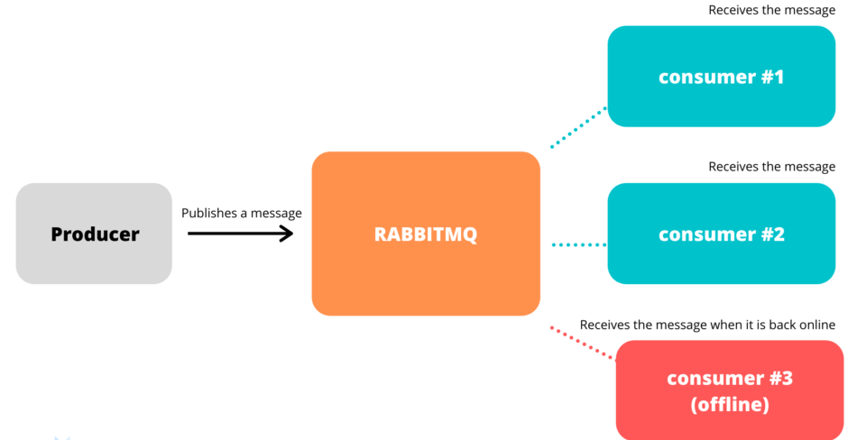

#### 我们将构建什么?

让我们模拟一个票务应用程序，用户可以在其中预订他/她的票。我们将使用RabbitMQ连接2个微服务进行通信。用户通过前端购票。在内部，这会从Ticket微服务生成一个POST请求。票据细节将被发送到RabbitMQ队列，该队列稍后将被OrderProcessing微服务使用。这些详细信息最终将存储到数据库中，用户将通过电子邮件收到订单状态通知。我们将保持应用简单。

那么，为什么要用RabbitMQ呢?我们不能直接POST到OrderProcessing微服务吗?

不。这违背了拥有微服务架构的目的。由于这是一个面向客户端的、面向业务的应用程序，我们应该确保订单始终存储在内存中，并且在任何时候都不会失败/丢失。因此，我们将订单细节推入队列。如果OrderProcessing微服务离线会发生什么?什么都不会发生!用户将收到类似于“门票已确认!”请等待确认邮件”。当OrderProcessing微服务上线时，它会从RabbitMQ服务器获取数据并进行处理，并通过电子邮件或短信通知用户。这是很棒的用户体验，对吧?

#### 环境配置

我们将使用ASP.NET Core 3.1 WebAPI与Visual Studio 2019 IDE。确保它们与最新的SDK一起运行。

之后，我们需要设置RabbitMQ服务器和仪表板。

#### 安装ErLang

Erlang是RabbitMQ服务器构建的一种编程语言。由于我们正在本地安装RabbitMQ服务器到我们的机器(Windows 10)，请确保首先安装了Erlang。

从这里下载安装程序- https://www.erlang.org/downloads。在撰写本文时，Erlang的最新可用版本是23.0.1 (105 Mb)。

使用管理员权限将其安装到您的机器中。

#### Windows环境下RabbitMQ作为服务安装

我们将在我们的Windows机器中安装RabbitMQ服务器和RabbitMQ服务。

从这里下载- https://www.rabbitmq.com/install-windows.html。我使用的是官方安装程序。确保您是管理员。

#### 启用RabbitMQ管理插件- Dashboard

现在我们已经在系统级别上安装了RabbitMQ服务，我们需要激活管理仪表板，默认情况下是禁用的。要做到这一点，打开命令提示符与Admin权限，并输入以下命令：

```powershell
//我们将安装目录作为cmd的默认工作目录。请注意，您的目录路径可能不同。
cd C:\Program Files\RabbitMQ Server\rabbitmq_server-3.8.7\sbin
//启用管理插件
rabbitmq-plugins enable rabbitmq_management
//重启RabbitMQ服务
net stop RabbitMQ
net start RabbitMQ
```

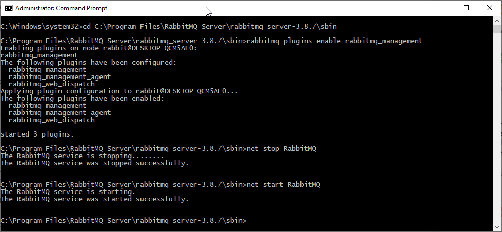

就是这样。现在导航到http://localhost:15672/。在这里你可以看到RabbitMQ的管理仪表板正在运行。

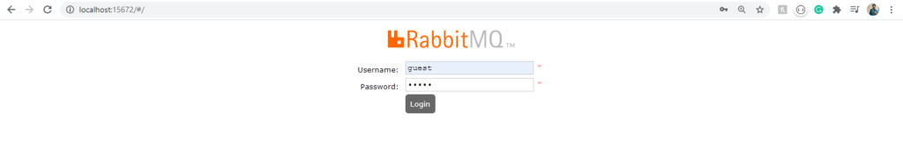

```
http://localhost:15672/—RabbitMQ的默认端口
```

默认凭据是guest/guest。使用它登录到您的仪表板。

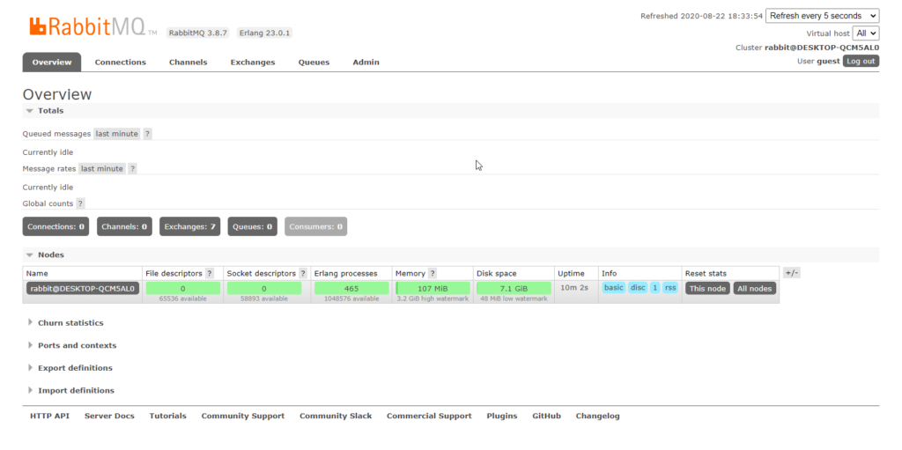

您可以看到我们的RabbitMQ服务器已经启动并正在运行。在开始设置整个应用程序时，我们将浏览所需的选项卡。但是，您可以通过Admin选项卡管理用户。

#### 入门-ASP.NET Core使用RabbitMQ

现在我们的服务器已经配置好了，让我们来构建可以通过RabbitMQ相互交互的实际微服务。在继续之前，我强烈建议你先学习一下[ASP.NET Core中的微服务架构](基于ASP.NET Core的微服务体系结构-使用Ocelot网关.md)来获得微服务架构如何工作的基本概念。我们还讨论了Ocelot配置的API网关。

我创建了一个新的空白解决方案“Microservices.Ticketing.WebApi”。这里我们将添加2个微服务:

1. Ticketing Microservice
2. Order Processing Microservice

```tex
由于这将是一个更加以RabbitMQ为中心的实现，我将跳过用户的数据库访问和电子邮件通知。我们将专注于发送和接收订票信息。
```

#### 共享模型库

创建一个新的 .NET Core类库项目，名称为“Shared.Models”。在这里，我们将定义共享模型，在我们的例子中是一个简单的Ticket模型。

```txt
重要-注意，必须有一个发布者/消费者都使用的共享Model类。这是因为RabbitMQ基于它的命名空间来处理消息。如果接收到的消息和传出的消息具有不同的命名空间(签名)，RabbitMQ将无法识别消费者。
//
不需要共享Model类。使用MassTransit 6.2.3可以将此检查设置为false。
```

下面是一个简单的Ticket类。我在Shared.Models项目中创建了Models/Ticket.cs类：

```
public class Ticket
{
    public string UserName { get; set; }
    public DateTime BookedOn { get; set; }
    public string Boarding { get; set; }
    public string Destination { get; set; }
}
```

#### 设置发布者微服务

请注意，在我们的需求中，第一个微服务本质上是向RabbitMQ队列发送Ticket模型的发布者。

让我们创建一个新的ASP.NET Core 3.1 WebAPI项目，命名为Ticketing.Microservice。

#### 安装所需的MassTransit包

打开包管理器控制台并安装以下程序。请注意，我们将在第二个微服务中安装相同的包，但配置不同。

```powershell
Install-Package MassTransit
Install-Package MassTransit.RabbitMQ
Install-Package MassTransit.AspNetCore
```

#### 什么是MassTransit?

MassTransit是对消息代理技术(如RabbitMQ)的. NET友好抽象。它通过提供大量开发友好的配置，使RabbitMQ的工作变得更容易。它本质上帮助开发人员在消息服务总线上路由消息，并支持RabbitMQ。

MassTransit没有特定的实现。它基本上像一个接口一样工作，是对整个消息总线概念的抽象。还记得Entity Framework Core是如何在数据访问层上提供抽象的吗?类似地MassTransit支持所有主要的消息总线实现，如RabbitMQ, Kafka等。

因为我们使用的是RabbitMQ，所以我们可以像RabbitMQ那样安装RabbitMQ.Client包等等，使我们能够与RabbitMQ服务器进行交互。但是，对于一个更干净、更经得起考验的解决方案，使用抽象总是明智的。从长远来看，这会让你的工作更轻松。

在我们的上下文中，我们将使用MassTransit Helpers来发布/接收来自RabbitMQ服务器的消息。明白了吧?

#### 配置MassTrasit

在添加了MassTransit包之后，我们必须ASP.NET Core容器中作为Publisher配置它。导航到Startup.cs并在services.AddController()之前添加以下内容：

```c#
public void ConfigureServices(IServiceCollection services)
{
    //将MassTransit服务添加到容器
    services.AddMassTransit(x =>
    {
        //使用RabbitMQ创建一个新的服务总线
        //在这里，我们传递主机url、用户名和密码等参数
        x.AddBus(provider => Bus.Factory.CreateUsingRabbitMq(config =>
            {
                config.UseHealthCheck(provider);
                config.Host(new Uri("rabbitmq://localhost"), h =>
                {
                    h.Username("guest");
                    h.Password("guest");
                });
            }));
    });
    services.AddMassTransitHostedService();
    services.AddControllers();
}
```

在此之后，让我们创建一个简单的API控制器，它可以接收用户传递的Ticket Model(通过POSTMAN)。创建一个新的API控制器Controllers/TicketController.cs

```C#
public class TicketController : ControllerBase
{
    //这里我们使用之前在Startup文件中配置的Bus变量
    private readonly IBus _bus;
    public TicketController(IBus bus)
    {
        _bus = bus;
    }
    [HttpPost]
    public async Task<IActionResult> CreateTicket(Ticket ticket)
    {
        if (ticket != null)
        {
            ticket.BookedOn = DateTime.Now;
            //我们将队列命名为ticketQueue
            //现在，让我们创建一个新的URL'rabbitmq://localhost/ticketQueue'
            //如果ticketQueue不存在，RabbitMQ会为我们创建一个
            Uri uri = new Uri("rabbitmq://localhost/ticketQueue");
            //获取可将共享模型对象发送到的端点
            var endPoint = await _bus.GetSendEndpoint(uri);
            //将消息推入队列
            await endPoint.Send(ticket);
            return Ok();
        }
        return BadRequest();
    }
}
```

这就是我们的第一个微服务，即消息Publisher。让我们构建并运行它。我们将使用POSTMAN将数据POST到Ticket端点。下面是我们将传递给Ticket端点的POST请求：

```json
{
    "userName" : "Mukesh",
    "Boarding" : "Muscat",
    "Destination" :"Trivandrum"
}
```

现在发生的是，端点将这个作为参数发送到**rabbitmq://localhost/ticketQueue**。这意味着RabbitMQ将为我们创建一个新的交换队列，并将传递的数据存储在服务器中。在通过POSTMAN发布消息后，让我们切换到RabbitMQ仪表板。

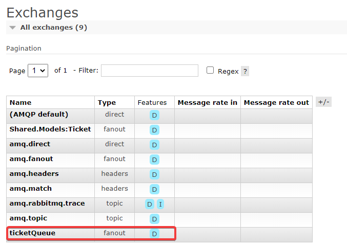

你可以看到RabbitMQ为我们创建了一个名为“ticketQueue”的新Exchange。此外，重要的是要注意，由于我们还没有此发布者的订阅者，因此我们传递的消息不会被看到。所以，让我们先建立一个消费者。

#### 设置消费者微服务

我们已经完成了发布者微服务，它可以向RabbitMQ Exchange发送票据。现在让我们创建一个新的ASP.NETCore WebAPI项目，并命名为“TicketProcessor.Microservice”。这个微服务将负责消费来自RabbitMQ服务器的传入消息并进一步处理。

还记得我们前面安装的包吗?在这个项目中也安装相同的包。

```
Install-Package MassTransit
Install-Package MassTransit.RabbitMQ
Install-Package MassTransit.AspNetCore
```

与前面的Startup.cs配置设置类似，我们也必须在这里进行配置，但请记住，这是一个消费者。

导航到新项目的Startup.cs并添加以下内容:

```c#
public void ConfigureServices(IServiceCollection services)
{
    services.AddMassTransit(x =>
    {
        //我们将添加一个名为TicketConsumer的新消费者。
        //当前我们还没有创建这个类。
        x.AddConsumer<TicketConsumer>();
        x.AddBus(provider => Bus.Factory.CreateUsingRabbitMq(cfg =>
        {
            cfg.UseHealthCheck(provider);
            cfg.Host(new Uri("rabbitmq://localhost"),h =>
            {
                h.Username("guest");
                h.Password("guest");
            });
            //这里我们定义Receive端点，因为这是一个消费者
            cfg.ReceiveEndpoint("ticketQueue", ep =>
            {
                ep.PrefetchCount = 16;
                ep.UseMessageRetry(r => r.Interval(2, 100));
                //最后我们将ticketQueue链接到TicketConsumer类
                ep.ConfigureConsumer<TicketConsumer>(provider);
            });
        }));
    });
    services.AddMassTransitHostedService();
    services.AddControllers();
}
```

现在让我们创建Ticket Consumer类**Consumers/TicketConsumer.cs**。添加以下代码。

```c#
public class TicketConsumer : IConsumer<Ticket>
{
    public async Task Consume(ConsumeContext<Ticket> context)
    {
    	//我们从上下文中提取实际的消息
        var data = context.Message;
        //Validate the Ticket Data
        //Store to Database
        //Notify the user via Email / SMS
    }
}
```

这是一个非常简单的消费者，实现了MassTransit类的IConsumer。发送到ticketQueue的任何带有Ticket Model签名的消息都将被此消费者接收。

稍后，我们将把已验证订单保存到数据库中，并通知客户。你明白我的意思吗?

#### 测试微服务

现在让我们测试我们的微服务。请记住，为了发送和接收票据数据，我们需要同时运行两个微服务。要启用多个启动项目，右键单击解决方案并在多个启动项目单选按钮中启用所需的项目。

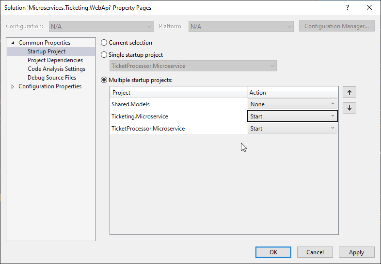


现在我们将测试几个场景。

#### 场景1-当消费者在线

首先，我们确保这两个服务在线，并尝试传递一些示例数据。我在消费者类和TicketController上设置了一个断点，以验证从POSTMAN接收到的数据。让我们运行应用程序并切换回POSTMAN。

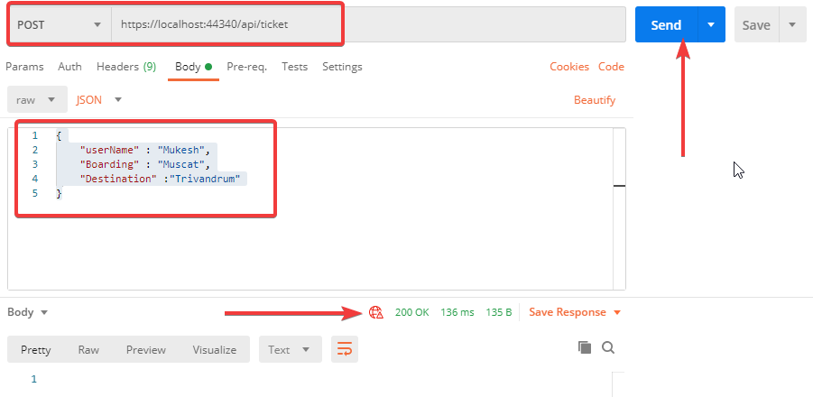

这就是我的POST请求的样子。如果一切顺利，我们应该在TicketController上有一个断点。让我们看下断点数据。

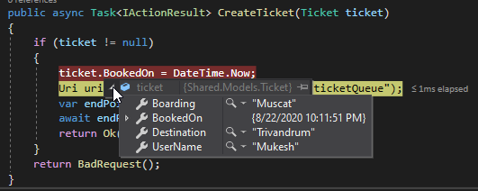

您可以看到，我们能够将模型传递给第一个微服务**Ticketing.Microservice**。让我们继续调试并切换回RabbitMQ仪表盘。

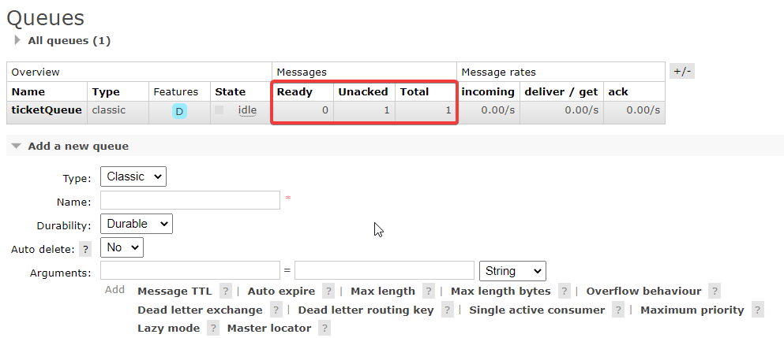


您可以看到“我们有一个未处理的消息”。此外，我们还将在第二个微服务上遇到下一个断点。让我们来验证一下数据。

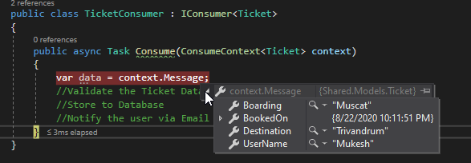


消费者按预期工作。太棒了!现在让我们进入下一个测试场景。

#### 场景2 -消费者离线-N分钟后重新上线

在这种情况下，一个更实际的场景是，由于几个原因，消费者可能离线。当使用者离线时，发布者仍然可以将消息发送到RabbitMQ服务器队列。一旦使用者联机，它就应该能够使用挂起的消息。这就是消息代理的全部意义，对吧?让我们尝试一下。

我禁用了消费者项目的启动。现在只有Ticketing.Microservice微服务运行。这模拟了消费者处于脱机状态的场景。

让我们通过POSTMAN把消息发送给Publisher吧。我们将得到一个200 Ok响应。让我们看看RabbitMQ的仪表盘。

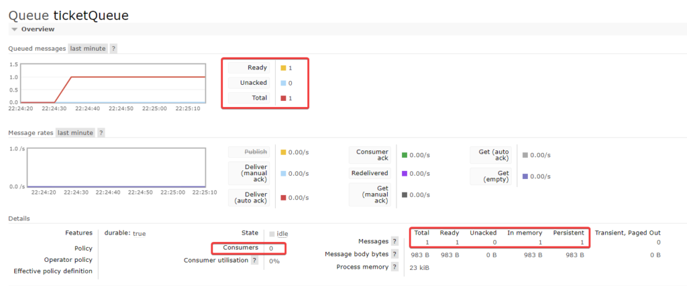


您可以清楚地看到，我们的队列有1个新Message挂起，0个消费者可用。它将把消息保存在内存中，直到连接到消费者。现在让我们的消费者上线。

一旦消费者微服务上线，您就可以看到我们正在触发挂起消息的断点。很酷,是吗?继续调试并切换回RabbitMQ仪表板。

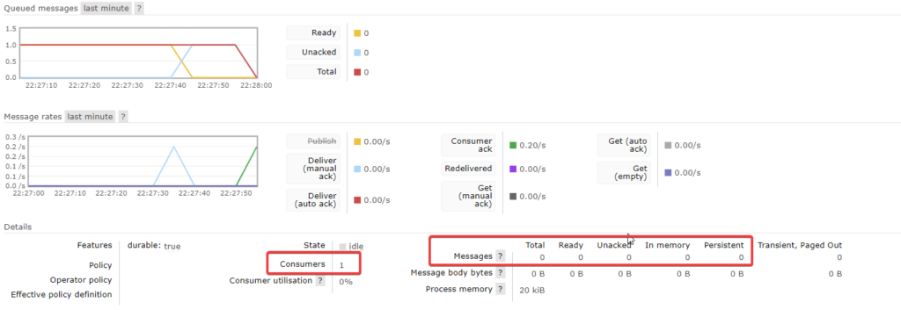


您可以看到，Consumer计数已变为1,Messages已变为0，这意味着我们的消息现在已被消费并从队列中取出。

本文到此结束!

#### 总结

在本文中，我们介绍了消息代理、RabbitMQ、优点、RabbitMQ与ASP.NET Core使用MassTransit的集成。我们还构建了一个小型原型应用程序，用于通过RabbitMQ服务器发送数据。您可以在[这里](https://github.com/iammukeshm/Microservices.Ticketing.WebApi)找到这个实现的源代码。

