[TOC]

原文：[基于ASP.NET Core的微服务体系结构-使用Ocelot网关](https://codewithmukesh.com/blog/microservice-architecture-in-aspnet-core/)

让我们来看看一种流行的构建应用程序的方法——ASP.NET Core中的微服务架构。在这篇详细的文章中，我们将尝试理解微服务架构到底是什么?，它与传统的构建应用程序的方式相比如何?还有一些高级的概念，如Ocelot的API网关，统一几个微服务，健康检查等等。

我们将构建一个简单的微服务应用程序来演示各种概念，包括ASP.NET Core中的微服务体系结构、API网关、Ocelot、Ocelot配置和路由等等。你可以在 [这里](https://github.com/iammukeshm/Microservice.WebApi)找到完整的源代码。

*这是一篇初学者友好的文章，这意味着如果你完全不了解微服务，我可以向你保证，在本文结束时你会获得足够的知识，你可能会有足够的信心开始用ASP.NET Core构建自己的简单微服务架构。收藏此页以备将来参考。*

### 基于ASP.NET Core的微服务体系结构-概述

在开始讨论微服务之前，让我们先谈谈构建应用程序的传统方式，你可能正在当前的解决方案中使用这种方法。它被称为整体式架构。

#### 整体架构-基础

整体体系结构是开发应用程序时传统且广泛使用的体系结构模式。它的设计方式使整个应用程序组件最终都是一个单一的部分，无论您如何尝试使用Patterns和Onion / Hexagonal Architecture来分离它们。所有服务都将与解决方案紧密耦合。需要注意的重点是，在发布应用程序时，您必须将它们部署到单个服务器上。

虽然它仍然是构建应用程序的一种很棒的方式，但与Monolith体系结构相关的一些缺点。任何中小规模的应用程序都可以很好地使用这种体系结构，但是当您突然开始进一步扩展时，您将不得不做出一些妥协，并在部署新版本/修复时面临某些停机时间。

这里是Monolith Architecture的一个非常简单的图示。

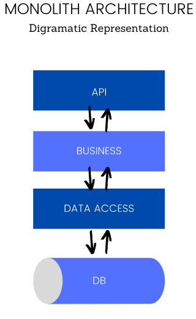

从图中可以很明显地看出，无论您想要与应用程序集成什么逻辑或基础设施，它最终都是应用程序本身的物理组成部分。对于较大的应用程序，这可能会在较长的运行时间内产生意想不到的影响。

#### 那么，什么是微服务架构?

在微服务架构中，应用程序本身被划分为不同的组件，每个组件都有特定的用途。现在这些组件统称为微服务。明白了吗?组件不再依赖于应用程序本身。每个组件在字面上和物理上都是独立的。由于这种令人敬畏的分离，你可以为每个组件设计专用的数据库，也就是微服务，以及将它们部署到单独的主机/服务器上。

为了说明清楚，我举个小例子。假设我们要建立一个ASP.NET Core电子商务应用程序。让我们更实际地隔离它。假设我们需要为电子商务应用程序构建一个API。你会怎么做呢?

传统的方法是在Visual Studio上构建一个单一的解决方案，然后通过层分离关注点。因此你可能会有像eCommerce.Core、eCommerce.DataAccess等类似的项目。现在，这些分离只是在代码组织级别上，并且只有在开发时才有效。当您完成应用程序时，您将不得不将它们发布到单个服务器上，在生产环境中再也看不到分离，对吗?

现在，这仍然是构建应用程序的一种很酷的方式。但我们来看一个实际的情况。我们的电子商务API有客户管理和产品管理的端点，很常见，对吧?现在，在与Customer端点相关的代码中有一个小的修复/增强。

如果您使用Monolith Architecture进行构建，那么您将不得不重新部署整个应用程序，并进行多次测试，以确保新的修复/增强不会破坏其他任何东西。DevOps工程师会真正理解这种痛苦。

但是如果你遵循微服务架构，你就会为客户、产品等创建独立的组件。这意味着您有2个API项目，分别针对客户端点和产品端点的需求。现在，这些微服务可以部署在Web中的任何地方，而不需要与主应用程序一起部署。通过这种方式，我们创建了一个干净的分离，并在物理上将应用程序解耦为不同的部分。

这听起来很容易实现，但实际上，这是一个相当复杂的体系结构。可能出现的一些复杂问题是，“如何让微服务彼此交互?”，身份验证呢?等等。这就是为什么微服务架构知识需求量很大。

下面是微服务架构的样子：

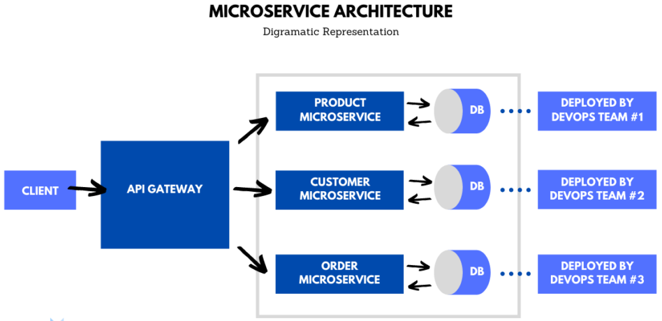

让我们浏览一下这个图表和某些关键字。

如前所述，我们正在尝试构建一个ASP.NET Core API解决方案的电子商务应用程序。现在，我们确定了可能成为微服务的组件。标识的组件是产品、客户和订单。现在每个微服务都将成为一个独立的WebApi项目。清楚了吗?这意味着我们将有3个ASP.NET Core WebApi在图中作为微服务。

这些组件/微服务不必全部构建在ASP.NET Core上。它可以非常灵活地使用Node & Express.js构建客户微服务，连接到MongoDb，其他服务可以使用ASP.NET Core构建。这取决于团队的可用性。这种架构使事情变得非常简单和灵活，对吧?

微服务可以使用共享数据库，甚至可以根据自己的偏好使用专用数据库。

现在我们有了微服务，让我们考虑一下它的部署。理想情况下，你不需要一个单独的DEVOPS团队来负责整个部署。你可能有多个DevOps团队，他们负责一个或多个微服务。

假设产品微服务部署到localhost:5000，客户微服务部署到localhost:6000，等等。在这个图中，客户端表示主应用程序。在我们的例子中，是电子商务应用程序。你不希望在一开始就提供这么多微服务给客户，这会让客户感到困惑。假设有50个微服务，客户必须了解每个微服务。不实际，对吧?

为了克服这个问题，我们在客户端和微服务之间引入了一个API网关。这个网关重新路由了所有的API端点，并将其统一到一个域中，这样客户端就不再关心这50个微服务了。

localhost:5000将被重新路由到localhost:4000/api/product/
localhost:6000将被重新路由到localhost:4000/api/customer/

localhost:4000是API网关的位置。通过这种方式，您的客户端连接到网关，网关反过来将数据/端点重新路由到微服务。现在了解这些已经足够了。我们将在本文后面的开发中详细介绍。我希望下面这个图表能让你更清楚的了解整体架构与微服务架构间的区别：

#### 微服务vs整体架构

| 整体架构                                                 | 微服务架构                             |
| :------------------------------------------------------- | :------------------------------------- |
| 一个包含所有业务组件和逻辑的解决方案                     | 多个服务，每个服务包含一个单一用途     |
| 单个数据库                                               | 每个微服务专用的数据库                 |
| 后端使用一种语言                                         | 每个微服务可以有多种技术/语言          |
| 解决方案必须部署到单个服务器。关注点的物理分离可能很棘手 | 每个微服务都可以部署在网络上的任何地方 |
| 服务将与应用程序本身紧密耦合                             | 松散耦合体系结构                       |

#### 我们将构建什么?

如前所述，以下是需求。我们必须在ASP.NET Core中构建一个包含API网关的简单的微服务架构。首先，我们将构建两个为客户和产品执行CRUD操作的微服务WebApi。我们还需要一个API网关，负责将客户端(浏览器或Postman)的传入请求重定向到微服务。更清楚地说，客户端必须访问API网关并在微服务上执行操作。

#### 开始构建

我们将完全用ASP.NET Core 3.1来构建这个实现。打开Visual Studio 2019并创建一个新的空白解决方案。您可以搜索“空白方案”，单击“下一步”。

*确保您使用ASP.NET Core  3.1及以上版本构建解决方案。*

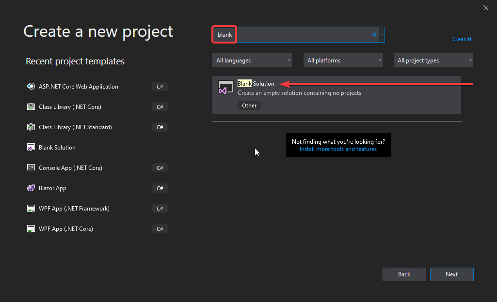

在下一个对话框中，我们将解决方案命名为Microservices.WebApi

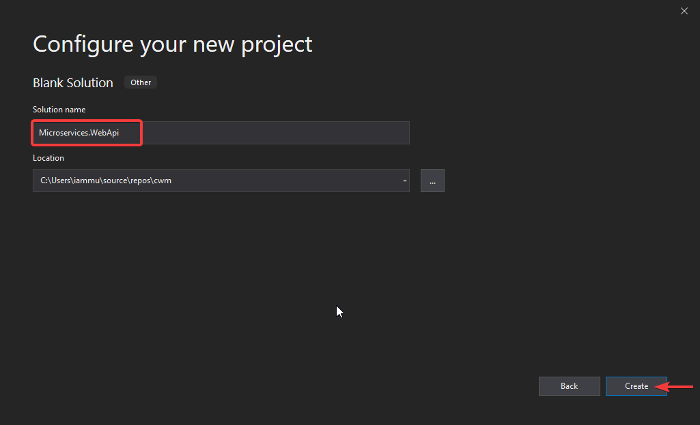

Visual Studio为您创建一个新的空白解决方案。在这里，添加一个新文件夹，并命名为Microservices。这是我们将添加所有微服务的文件夹。右键单击Microservices文件夹并添加一个新项目。让我们先添加产品微服务。这将是一个ASP.NET Core WebApi项目-命名为**Product.Microservice**。

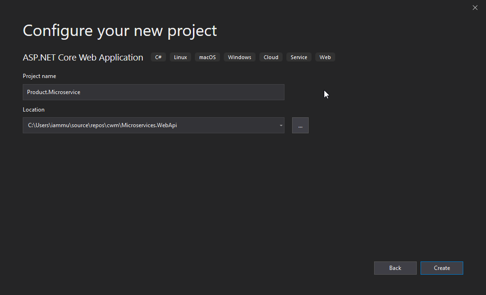

类似地，创建一个**Customer.Microservice**项目。接下来让我们添加API网关。

在解决方案的根目录中，添加新的ASP.NET Core项目并命名为**Gateway.WebApi**。这将是一个空项目，因为在这个网关中没有太多的东西。

下面就是文件夹结构的样子：

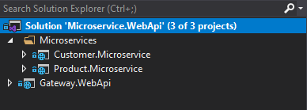

基本上，所有与客户相关的CRUD操作都归Customer. Microservice所有，所有与产品相关的东西都归Product.Microservice。客户端将访问网关的URL以使用客户和产品操作。理想情况下，微服务应该是内部的，如果没有API网关的帮助，公众是无法访问的。

#### 设置微服务

让我快速为两个微服务设置一个简单的CRUD操作。我将使用Entity Framework Core作为数据访问技术以及每个服务的专用数据库。因为创建CRUD Api超出了本文的范围，所以我将跳过这些步骤，直接将两个微服务和CRUD端点都准备好。还建议设置Swagger。

如果您需要关于构建ASP.NET Core WebApi的详细指南，我强烈建议你阅读下面的文章。

1. [在ASP.NET Core中使用EntityFrameworkCore](在ASP.NET Core中使用EntityFrameworkCore.md)
2. [在ASP.NET Core中使用MediatR实现CQRS](在ASP.NET Core中使用MediatR实现CQRS-终极指南.md)

我们需要为两个微服务建立不同的数据库连接。这不是强制性的，但它可以让你理解微服务的实现。以下是两个微服务的Swagger UI展示。

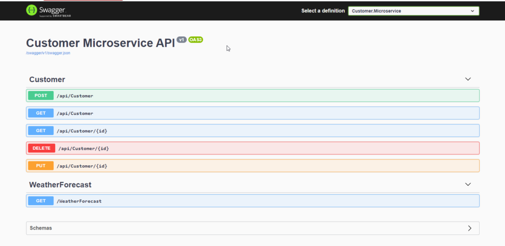


还记得API网关吗?现在让我们更多地谈谈它。

#### Ocelot API网关简介

Ocelot是一个用于.NET/Core平台的开源API网关。它的功能很简单。它统一多个微服务，这样客户端就不必担心每个微服务的位置。Ocelot API Gateway转换来自客户端的传入HTTP请求，并将其转发给适当的微服务。

Ocelot被微软和其他科技巨头广泛应用于微服务管理。Ocelot的最新版本针对ASP.NET Core 3.1，不适合.NET Framework应用程序。将Ocelot包安装到API Gateway项目并设置一个JSON配置文件来声明上游和下游路由非常简单。

上游和下游是你必须弄清楚的两个术语。上游请求是客户端发送给API网关的请求。下游请求是API网关发送给微服务的请求。所有这些都是从API网关的角度出发的。让我们看一个小图来更好地理解这个概念:

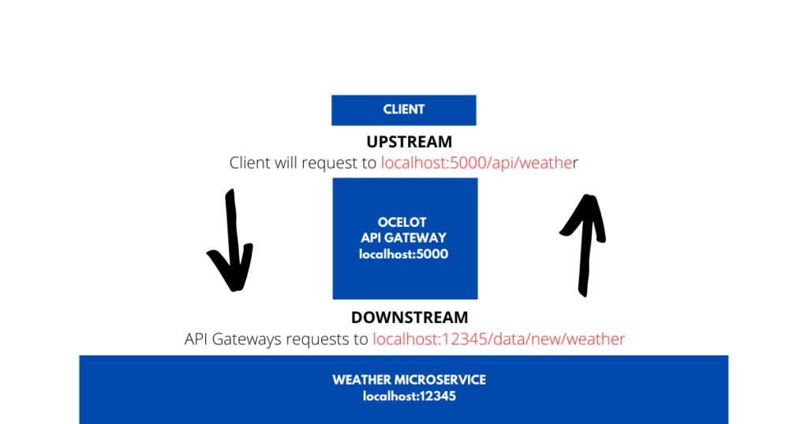


这会帮助你更好地理解。API网关位于端口5000，而微服务端口位于12345。现在客户端不能访问端口12345，而只能访问端口5000。因此，客户端向localhost:5000/api/weather发送请求以接收最新的天气。Ocelot API Gateway的功能非常有趣，它接收来自客户端的传入请求，并向Microsevrice发送另一个HTTP请求，后者返回所需的响应。完成此操作后，网关将响应发送到客户端。localhost:5000是客户端知道的网关的上游路径，localhost:123456是API网关知道的下行路径。现在说得通了，对吧?

通过这种方式，Ocelot API Gateway将能够将各种请求从客户端重新路由到所有相关的微服务。我们必须在API网关中配置所有这些路由，以便Ocelot知道如何以及在哪里路由传入的请求。

以下是Ocelot 的一些显著特性：

- 将传入请求路由到所需的microservice
- 身份验证
- 授权
- 企业应用程序的负载均衡

#### 构建Ocelot API网关

导航到我们之前创建的Gateway.WebApi 项目。
首先，安装Ocelot包：

```powershell
Install-Package Ocelot
```

其次，配置Ocelot与我们的ASP.NET Core 3.1应用一起工作。进入Gateway.WebApi的**Program.cs**类并修改CreateHostBuilder方法，如下所示：

```c#
public static IHostBuilder CreateHostBuilder(string[] args) =>
    Host.CreateDefaultBuilder(args)
        .ConfigureWebHostDefaults(webBuilder =>
        {
            webBuilder.UseStartup<Startup>();
        })
    .ConfigureAppConfiguration((hostingContext, config) =>
    {
        config
        .SetBasePath(hostingContext.HostingEnvironment.ContentRootPath)
        .AddJsonFile("ocelot.json", optional: false, reloadOnChange: true);
    });
```

由于Ocelot从JSON配置文件中读取路由配置，因此上面调用**AddJsonFile**方法，以便ASP.NET Core 3.1应用程序可以访问**ocelot.json**配置。注意，我们还没有创ocelot.json文件。我们会在配置Ocelot中间件之后创建。

接下来，导航到Gateway.WebApi 的**Startup.cs**类并将Ocelot添加到ConfigureServices方法中。

```c#
public void ConfigureServices(IServiceCollection services)
{
    services.AddOcelot();
}
```

最后，转到**Configure**方法并进行以下更改。这将Ocelot中间件添加到ASP.NET Core 3.1应用程序的管道：

```c#
public async void Configure(IApplicationBuilder app, IWebHostEnvironment env)
{
    if (env.IsDevelopment())
    {
        app.UseDeveloperExceptionPage();
    }
    app.UseRouting();
    app.UseEndpoints(endpoints =>
    {
        endpoints.MapControllers();
    });
    await app.UseOcelot();
}
```

#### 配置Ocelot路由

这是本文最重要的部分。这里是为API网关配置上行/下行路由的地方，这有助于Ocelot了解路由。

让我们添加一个基本的路由设置，以便我们了解它是如何工作的。我们将从产品微服务开始。假设客户端想要通过API网关获取所有的产品。

首先，使用产品微服务的Swagger UI，随机添加一些产品。一旦完成通过Swagger检查GET ALL请求。

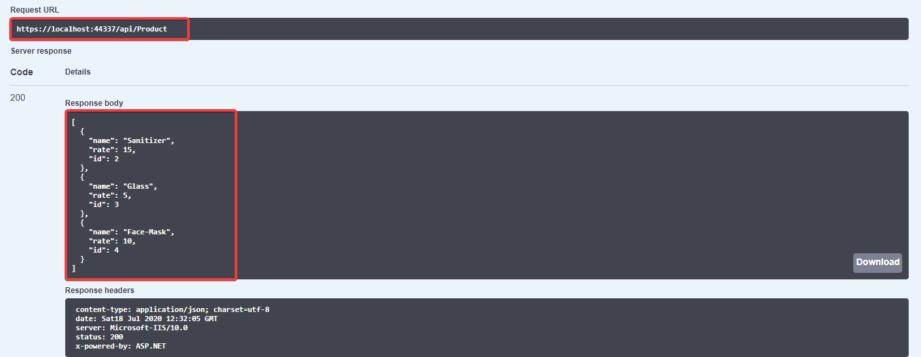

目前，我们通过产品微服务从产品数据库中获得了3个产品。

在Gateways.WebApi项目的根目录中创建一个新的JSON文件。**该文件将包含Ocelot所需的配置**。我们将这个文件命名为ocelot.json。我们已经在Program.cs文件中注册了这个名称，还记得吗?

```json
{
  "Routes": [
    {
      "DownstreamPathTemplate": "/api/product",
      "DownstreamScheme": "https",
      "DownstreamHostAndPorts": [
        {
          "Host": "localhost",
          "Port": 5000
        }
      ],
      "UpstreamPathTemplate": "/gateway/product",
      "UpstreamHttpMethod": [ "POST", "PUT", "GET" ]
    }
  ]
}
```

Ocelot接收一个路由对象数组。
作为数组中的第一个元素，让我们配置Product微服务的Get All、Update和Insert端点。

- **DownstreamPathTemplate**表示微服务中实际端点的路由。
- **DownstreamScheme**是微服务的方案，这里是HTTPS
- **DownstreamHostAndPorts**定义了微服务的位置。我们将在这里添加主机和端口号。
- **UpstreamPathTemplate**是客户端请求Ocelot API网关的路径。
- **UpstreamHttpMethod**是API网关支持的HTTP方法。基于Incoming Method, Ocelot也会向微服务发送一个类似的HTTP方法请求。

现在让我们测试一下。根据我们的配置，我们必须向网关发送请求。WebApi位于localhost:4000的路由localhost:4000/gateway/product，我们希望直接从微服务(位于localhost:5000)获得结果。

构建解决方案以确保没有错误。现在，有一件事需要更改。我们现在有3个API。让我们配置解决方案，以便在运行应用程序时触发所有3个API。这是因为我们需要所有的API在线。

要启用多个启动项目，请右键单击解决方案并单击属性。在这里，选择“多个启动项目”选项并启用所有项目。

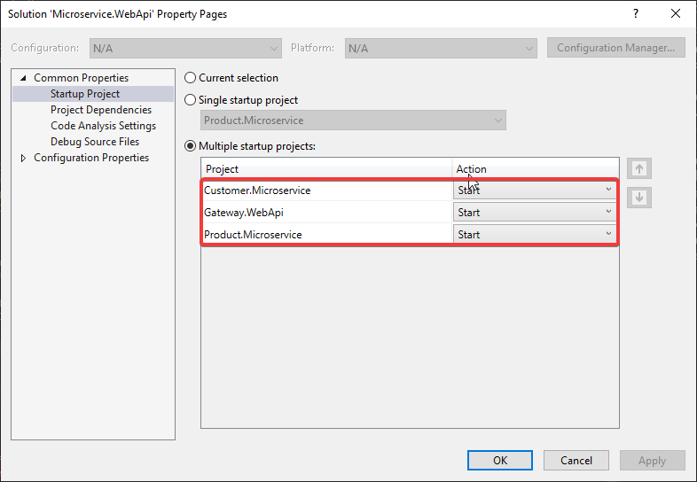

Run the Solution and navigate to **localhost:4000/gateway/product**


很好，我们已经成功地实现了API网关，并在ASP.NET Core中创建了一个简单的微服务架构。

使用POSTMAN，您还可以测试POST和UPDATE方法。

但是我们仍然缺少GetById和Delete HTTP方法。我们必须为此添加另一条路由，因为我们还向这些端点传递了一个ID参数。明白吗?

这是下一条路由的样子。这是一个基于参数的路由，与前面的设置类似：

```json
{
  "Routes": [
    {
      "DownstreamPathTemplate": "/api/product",
      "DownstreamScheme": "https",
      "DownstreamHostAndPorts": [
        {
          "Host": "localhost",
          "Port": 44337
        }
      ],
      "UpstreamPathTemplate": "/gateway/product",
      "UpstreamHttpMethod": [ "POST", "PUT", "GET" ]
    },
    {
      "DownstreamPathTemplate": "/api/product/{id}",
      "DownstreamScheme": "https",
      "DownstreamHostAndPorts": [
        {
          "Host": "localhost",
          "Port": 44337
        }
      ],
      //我们接受路由中的ID参数
      "UpstreamPathTemplate": "/gateway/product/{id}",
      //我们将方法限制为GET和DELETE
      "UpstreamHttpMethod": [ "GET", "DELETE" ]
    }
  ]
}
```

现在让我们测试一下。导航到localhost:4000/gateway/2

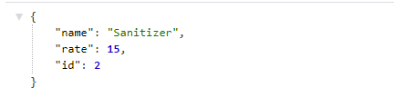

完美工作!是吗?

就是这样。我们已经完成了Ocelot API网关的配置，以支持产品微服务。我将把客户微服务的配置留给您作为一个小实践。你可以找到完整的[ocelot. json](https://github.com/iammukeshm/Microservice.WebApi/blob/master/Gateway.WebApi/ocelot.json)供参考。

我们将在这里结束这篇文章。我希望你已经学到了很多关于ASP.NET Core微服务架构的知识。

#### 总结

在本文中，我们已经学习了ASP.NET Core中的微服务架构、Ocelot API网关的概念、Ocelot和Ocelot配置的基础知识等等。您可以在[这里](https://github.com/iammukeshm/Microservice.WebApi)找到完整的源代码。

我们将在另一篇文章中介绍其他高级概念，如日志记录、JWT身份验证、身份服务器等。但是对于初学者来说，这些信息已经足够帮助您理解微服务是如何工作的了。

我希望你从这篇文章中学到了一些新的与细节的东西。如果你有任何评论或建议，请在下面的评论区留下。不要忘记在您的开发人员社区中分享本文。谢谢大家，快乐编码!


